## Introduction

#### Disclaimer

>[!WARNING]
>This article was created for informational purposes only and is intended for security analysis specialists who analyze the security of the customer's resources strictly on legal grounds and on the basis of an agreement concluded with the customer company. It should not be used to make any statements or claims, offer warranties regarding the utility, safety, or suitability of the code, the product, the business model, or to express opinion about the mentioned companies or their products. 
>
>The author is not responsible for any harm caused by the use of the information provided. 
>The spread of malware and disruption of systems are prosecuted by law. 
>Sensitive information is deliberately redacted (hidden or modified).

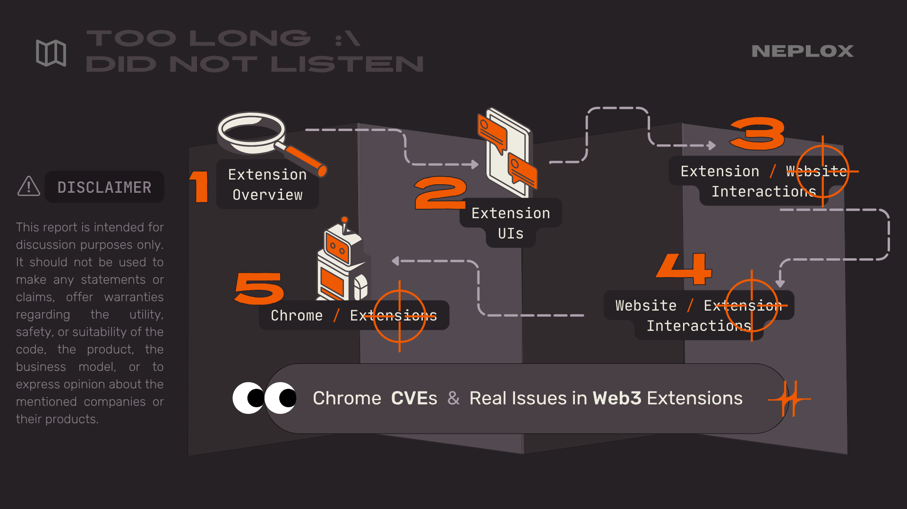

#### Outline

- Introductory explanation of modern browser extension architecture: inline (injected) scripts, content scripts, background scripts;
- Starting with a few easy miscellaneous issues we have found and reported, such as misconfigurations which lead to unexpected **Clickjacking** of extensions;
- Continuing with more **advanced attacks** and bugs related to inline/content scripts which occur due to the shared JS context and manipulation of the opened website's document, such as **Stored Universal XSS** achievable using an extension;
- Ending with **complex attacks on messaging protocols** between the different parts of browser extensions. We will disclose the common bugs we discovered, how they were fixed, and how secure messaging should ideally be implemented;
- To conclude our presentation we plan to speak about a few **best practices** which we were able to distinguish for ourselves when it comes to browser extension development, as well as recommend some libraries for secure development of extensions.

>[!NOTE]
>This is an authored translation of a transcript of our talk ‟**Attacking Crypto Wallets**: an In-Depth Look at Modern Browser Extension Security” that was presented by our team at [**SECCON**](https://seccon.jp/) in **Tokyo**, [**Zer0con**](https://zer0con.org/) in **Seoul**, and recorded at [**Positive Hack Days**](https://phdays.com/en/) Cybersecurity conference in **Moscow**.
>
> - Watch the video for an English voice-over translation of the talk: [blobs.neplox.security/phdays-attacking-crypto-wallets.mp4](https://blobs.neplox.security/phdays-attacking-crypto-wallets.mp4)
> - Have a look at the slides: [blobs.neplox.security/attacking-crypto-wallets.pdf](https://blobs.neplox.security/attacking-crypto-wallets.pdf)<br/>
>&ensp;
>
>**Related CVEs**:
>- [`CVE-2024-10229`](https://chromereleases.googleblog.com/2024/10/stable-channel-update-for-desktop_22.html) (Chromium security severity: **High**):&ensp;Inappropriate implementation in Extensions in Google Chrome prior to `130.0.6723.69` allowed a remote attacker to bypass site isolation via a crafted Chrome Extension.
>- [`CVE-2024-11110`](https://chromereleases.googleblog.com/2024/11/stable-channel-update-for-desktop_12.html) (Chromium security severity: **High**):&ensp;Inappropriate implementation in Extensions in Google Chrome prior to `131.0.6778.69` allowed a remote attacker to bypass site isolation via a crafted Chrome Extension.<br/>
>&ensp;

## Overview

To give you a quick idea of why this report matters: the bottom line is that we are no longer just talking about millions, but literally billions of dollars flowing through browser-based crypto wallet extensions. They have become the primary gateway for interacting with blockchains – signing transactions, sending funds, and so on. Despite this, the industry lacks a fundamental approach or established security patterns for extensions, so we decided to step in and bridge that gap.

We will start by breaking down the general architecture of browser extensions. Imagine you have a web page and an extension that connects to it. In the context of an extension, there are essentially four core components:
1. **`inpage` script**: A script injected just like any other script on the site, meaning it shares the same global context as the site's own scripts.
2. **`content` script**: This is also injected into the site's context, but it lives in an isolated environment. We will dive into the details of this shortly.
3. **`background` script**: Think of this as a microservice that runs constantly in the background. It monitors all pages and handles the most critical logic.
4. **Data Storage**: A separate storage area that the extensions themselves can access.

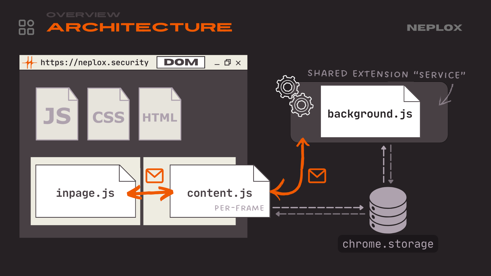

Let's start with the `background` script. When dealing with browser extensions, the most important file is `manifest.json`. Essentially, this is the extension's blueprint; it defines all core permissions, specifies which files load in the `background` versus as `content` scripts, sets loading rules, and so on. As mentioned earlier, if you look at an extension's code, you will see a background worker or service worker defined, which acts as the shared microservice for the entire extension.

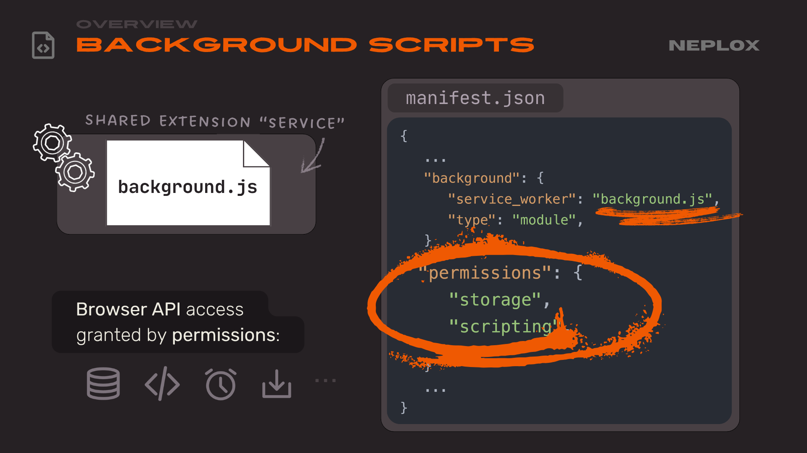

```json title="manifest.json"
{
	"background": {
		"service_worker": "background.js",
		"type": "module",
	},
	"permissions": {
		"storage",
		"scripting",
	}
}
```

When it comes to the storage used by extensions, there are two main branches:
1. First, there is the **Chrome Storage API**. This is a privileged API available to the extension that offers three types of storage: `storage.session`, `storage.local`, and `storage.sync`. For the purposes of this report – and extension security in general – the distinction between `session`, `local`, and `sync` is not critical. The key takeaway is that `local` and `sync` storage are accessible by default from both the `background` script and the `content` script.
	- `sync`: As the name suggests, this storage syncs across all browser instances where you are logged into your, say, Google account. For it to be accessible within a `content` script, developers have to enable it manually. While the `content` script is injected into the website itself, we also have the extension's own internal page, usually located at the `chrome-extension://{extension_id}` domain. Just like any other website, it has standard web storage: IndexedDB, Cookies, Local Storage, Cache, etc.
	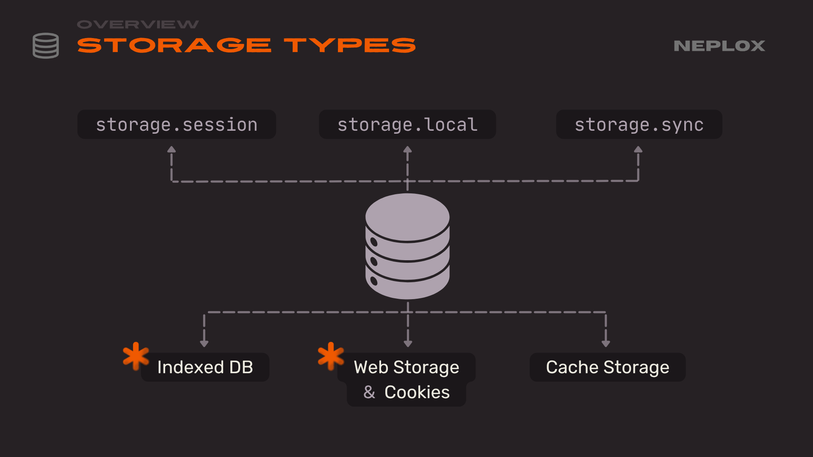
	- `content` script: It is important to understand why this exists. As we noted earlier, the main difference between this and an `inpage` script is context isolation. This means variables or overridden standard functions are not shared with the main page context. This prevents the site's standard flow – or an attacker – from interfering with the extension. However, we still have full access to the Document Object Model (DOM), can use `postMessage`, and have full access to the site's Storage, IndexedDB and everything else.
	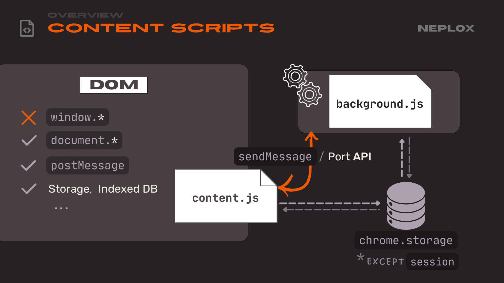

2. Another crucial part of the `content` script is the `sendMessage` API. This is the API that allows it to communicate with the `background` script, which we will cover more later. Here is roughly how it looks in the `manifest.json` file:
	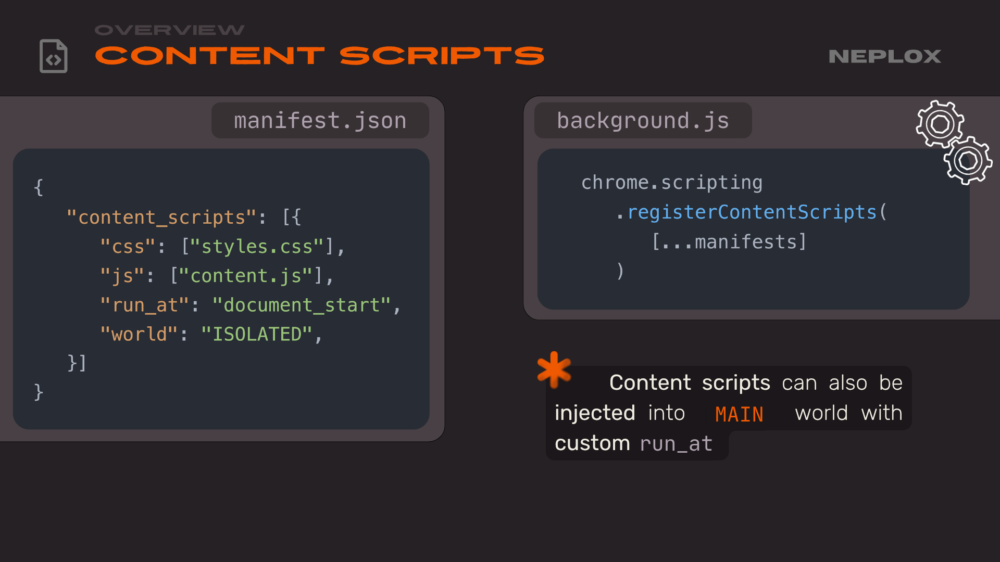

	```json title="manifest.json"
	{
		"content_scripts": [{
			"css": ["styles.css"],
			"js": ["content.js"],
			"run_at": "document_start",
			"world": "ISOLATED",
		}]
	}
	```

	```js title="background.js"
	chrome.scripting
		.registerContentScripts(
			[...manifests]
		)
	```

	We simply specify which file to load and define the world – essentially stating whether it should be loaded in isolation or not. If you do not specify this directive, the `content` script loads as isolated by default. You can also use the `chrome.scripting` API to load it at runtime via the `background` script.

Finally, the most critical concept mentioned several times here is the **Isolated Worlds** mechanism. For every extension, a separate context is created on the website, yet they all share the same DOM. This leads to several issues (which we discuss later in this report), because as an extension developer, you have no way of knowing what other extensions a user might have running alongside yours.
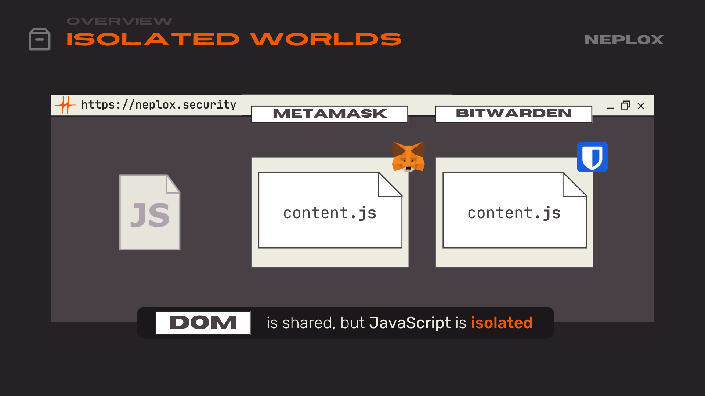

## Attacking UIs

Let's move on to the section regarding attacks on extension interfaces. What exactly is an extension interface? What are the different types?

In the classic sense, it is usually that popup you see when you click the extension icon. In **Chrome**, there is also an option to use a side panel. An interesting point here is that all these resources are hosted on the extension's own origin. This means the resources are bundled within the extension archive and installed locally. Besides being used for the extension's own UI, these elements can also be injected into the websites the extension interacts with.
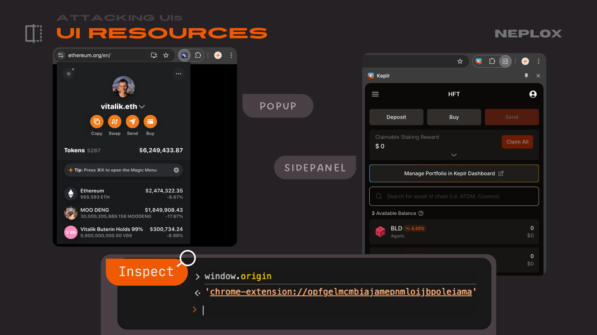

A specific example here is how **Rainbow Wallet**, for instance, injects its own custom styles for the popup it displays for notifications: 
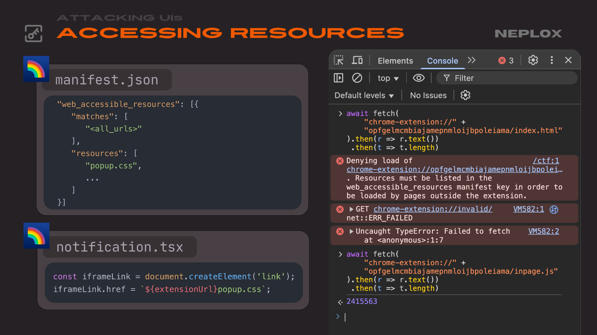

```json title="rainbow-wallet/manifest.json"
"web_accessible_resources": [{
	"matches": [
		"<all_urls>"
	],
	"resources": [
		"popup.css",
	]
}]
```

```typescript title="rainbow-wallet/notification.tsx"
const iframeLink = document.createElement('link');
iframeLink.href = `${extensionUrl}popup.css`;
```

What's interesting is that these resources are accessible from the website in various ways. In this example, it is injected as a stylesheet, but these resources can also be requested via `fetch` or embedded through an `iframe`.
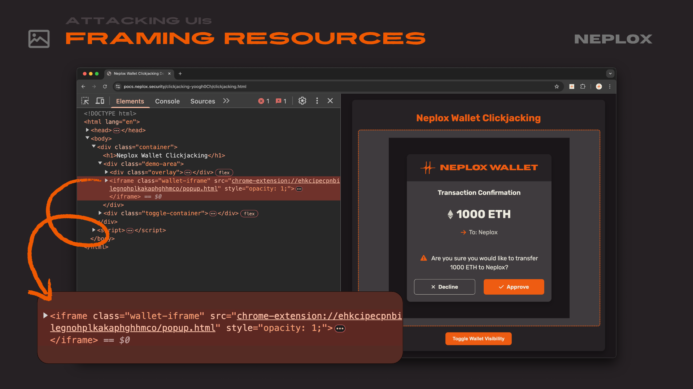

```html
<iframe class="wallet-iframe" src="chrome-extension://{id}/popup.html" style="opacity: 1;">
</iframe>
```

A classic problem arises when any resource can be wrapped in an `iframe` – we can perform something similar to a traditional **Clickjacking** attack. This has been used quite frequently in real-world attacks and was something we identified while analyzing several crypto wallets. If an extension allows any of its HTML files to be `iframe`'d, we can simply pull a page like `approve.html` into an `iframe` on our site, which contains a button to sign or send a transaction. Then, using standard Clickjacking techniques, we overlay a fake button like _"Claim free NFT"_, _"Login"_ or _"Back"_.

The user thinks they are clicking something completely unrelated to their wallet, but in reality, they are signing a transaction that drains their funds.
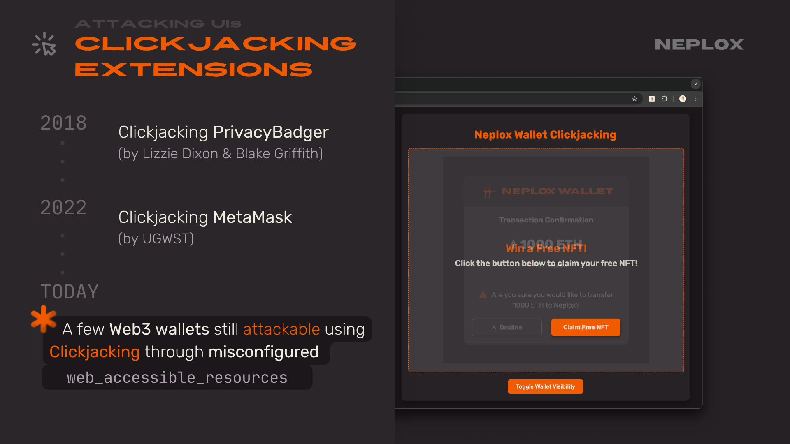

What's another major issue?
Many developers have already learned that you should not make sensitive pages web-accessible. However, there is a specific behavior in **Chrome** – not a 0-day, but poorly documented and often overlooked feature – if you `iframe` a permitted page and that page redirects to one that is not a Web Accessible Resource, the redirect still works. Essentially, if you find an **Open Redirect** on any allowed page, you can still achieve Clickjacking on a sensitive page like `approve.html` and steal the user's money.
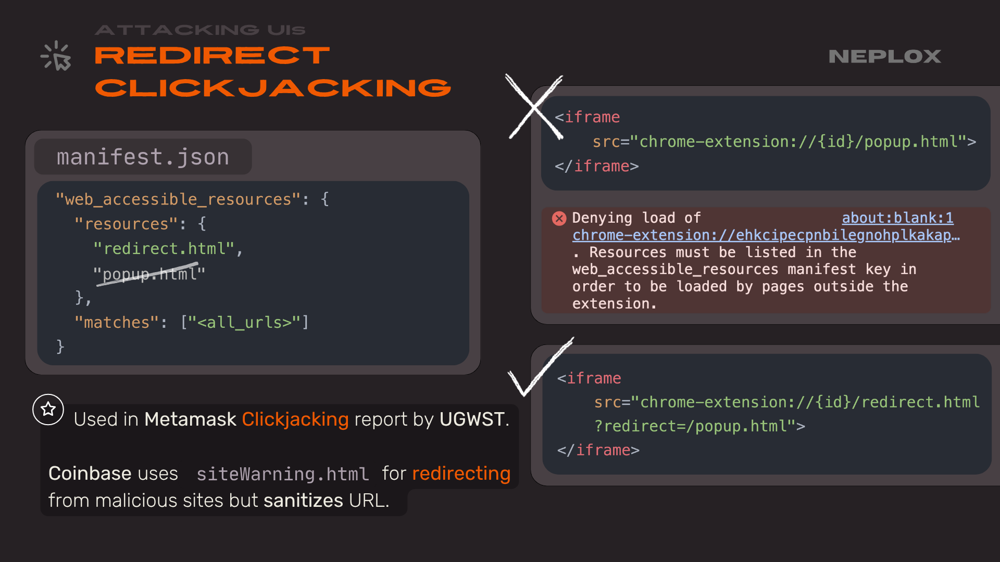

```json title="manifest.json"
"web_accessible_resources": [{
	"resources": [
		"redirect.html",
		~~"popup.html"~~
	],
	"matches": ["<all_urls>"]
}]
```

```html title="❌"
<iframe
	src="chrome-extension://{id}/popup.html">
</iframe>
```

```html title="✅"
<iframe
	src="chrome-extension://{id}/redirect.html?redirect=/popup.html">
</iframe>
```

This exact method was used for a Clickjacking exploit in **Metamask** a couple of years ago, which resulted in a bounty of $120,000: [metamask.io/news/metamask-security-monthly-june-2022](https://metamask.io/news/metamask-security-monthly-june-2022#clickjacking-vulnerability). Similar redirect patterns are still seen today; for example, we found something similar in **Coinbase**, though fortunately, it validates the redirect URL.

Another interesting problem that many people probably do not consider is **UI Redressing**. It is when we manipulate the extension or app's UI using arbitrary data in ways the developers never intended. We found an example of this in a **TON**-based wallet: they were not properly sanitizing special Unicode characters (e.g. `\u2000`). Because of this, a dApp could be given a name that effectively redrew the UI, replacing standard wallet info with our own text. These attacks are especially dangerous when chained with other exploits. For instance, if you could trigger an XSS through a link in that UI, you could trick the user into an **XSS vulnerability** within their own crypto wallet, which means game over for their funds.

You can also find out more about this in our article: ["TON't Connect! NOTe on securing TON Wallets"](https://neplox.security/research/securing-ton-wallets).
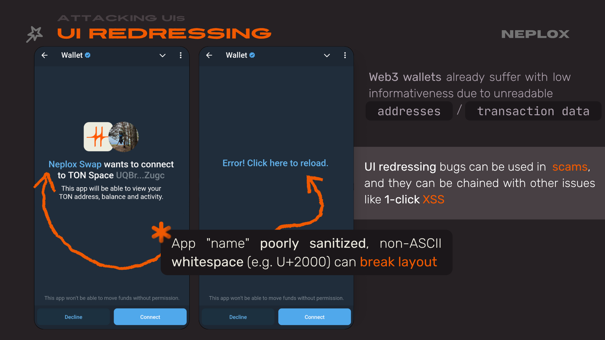

Why is this such a big deal, even though it seems simple?
It is particularly critical for crypto wallets because they already provide very little information to the user, and people often sign transactions without fully knowing what's inside them. This lack of transparency only makes the problem worse.

## Extension vs Website

Next, let's move on to more technical attacks: what extensions can actually do to websites, the risks we expose ourselves to when using them, and how vulnerabilities within extensions can be exploited to attack other sites.

As previously mentioned, extensions utilize both `content` scripts and `inpage` scripts. Both are scripts that run in a context tied to the HTML – essentially the DOM model of the page itself. It turns out that extensions can modify any element of this DOM, a capability used by almost every extension out there.
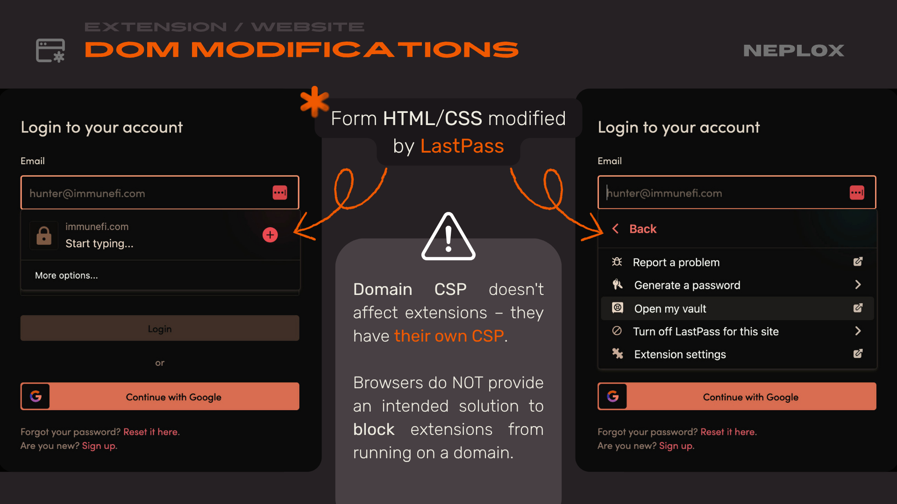

Take **LastPass** as an example: the extension injects its own UI elements to enable password autofill from the manager. This seems harmless enough, but the problem is that from a website's perspective, there is no way to protect yourself. Browsers ignore a site's security policies when extensions apply changes to the DOM. The Content Security Policy (CSP) you have set for your site will be bypassed; the extension operates solely under its own CSP, which does not stop it from modifying the site however it pleases.

It goes even further: they do not just rewrite styles and HTML; they can also inject their own scripts. While `content` scripts usually run in an isolated environment that prevents direct interaction with the domain's context, nothing stops extensions from inserting inline or `inpage` scripts. These run directly in the site's context, giving the script full access to all your defined variables and, essentially, the entire application memory. The extension has total access to every part of the domain it runs on. Again, CSP and other domain policies are ignored here, allowing the extension to do practically whatever it wants.
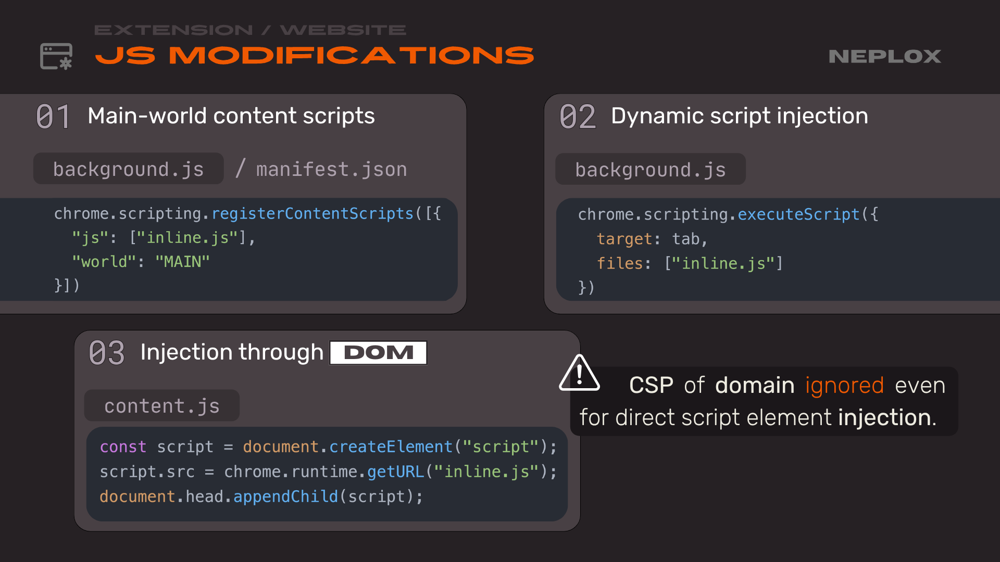

1. Main-world content scripts:
	```js title="background.js"
	chrome.scripting.registerContentScripts([{
		"js": ["inline.js"],
		"world": "MAIN"
	}])
	```

2. Dynamic script injection:
	```js title="background.js"
	chrome.scripting.executeScript({
		target: tab,
		files: ["inline.js"]
	})
	```

3. Injection through DOM:
	```js title="content.js"
	const script = document.createElement("script");
	script.src = chrome.runtime.getURL("inline.js");
	document.head.appendChild(script);
	```

We mentioned **Rainbow Wallet** earlier, but **Zerion** serves as another good example. The wallet displays a notification whenever an action occurs – for instance, when you switch the selected blockchain network. It does this by injecting HTML and additional styles to render the notification directly within the site's DOM.
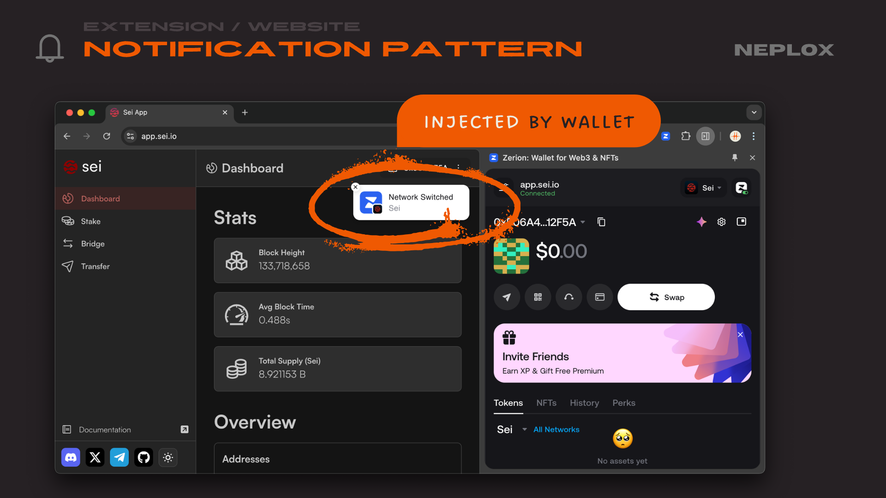

If we look at **Zerion**'s implementation, we see they insert this via `innerHTML`. Anyone familiar with web security knows this is a major red flag, as it leads directly to XSS. Here specifically, the network URL (`networkUrl`) and an icon (`networkIcon`) are being injected into. It might seem trivial, but why is this a problem for crypto wallets? Because decentralized Web3 apps work across many different networks and must be able to add new ones. That's the catch: from our own web app and domain, we can add a new network and set whatever parameters we want.
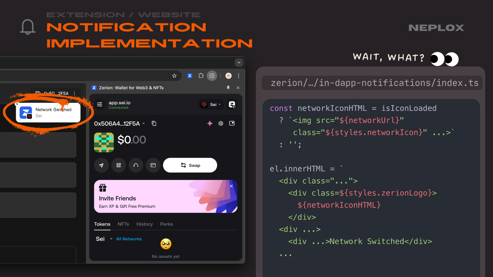

```typescript title="zerion/.../in-dapp-notifications/index.ts"
const networkIconHTML = isIconLoaded
	? ``
	: '';

el.innerHTML = `
	<div class="...">
		<div class=${styles.zerionLogo}>
			${networkIconHTML}
		</div>
	<div ...>
		<div ...>Network Switched</div>
	...
```

If we pass a malicious payload into the icon field that fits the injection point, nothing suspicious will even be visible – the icon renders, everything looks fine, and the user will not notice a thing. Yet, we have successfully achieved **XSS**.
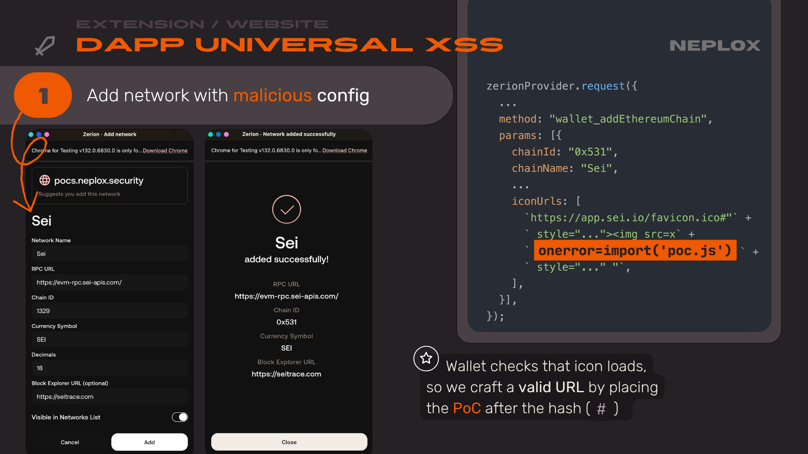

```js
zerionProvider.request({
	...
	method: "wallet_addEthereumChain",
	params: [{
		chainId: "0x531",
		chainName: "Sei",
		...
		iconUrls: [
			`https://app.sei.io/favicon.ico#"` +
			` style="..."> {
		// ... check event origin ...
		handle(event.data)
	}
	```

	```js title="→"
	target.postMessage(data, expectedOrigin)
	```

2. The second is the **origin-wide** approach. This does not allow frame-to-frame messaging but instead broadcasts messages by ID to all tabs of the current origin. This uses the **`BroadcastChannel`** API, though it is not the most popular method.

	```js title="←"
	new BroadcastChannel(randomID()).onMessage = handle
	```

	```js title="→"
	new BroadcastChannel(randomID()).postMessage(data)
	```

3. We can also use **`MessageChannel`**, but in reality, it is just a wrapper around `postMessage` and `BroadcastChannel` and does not introduce any fundamental changes.

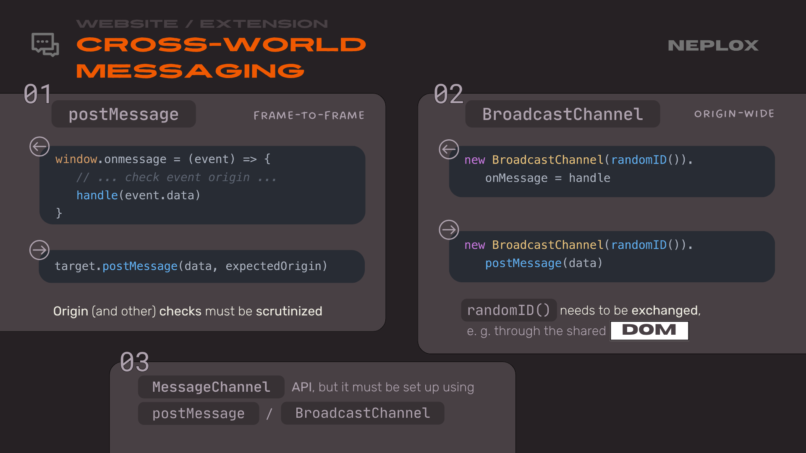

The first issue we discovered in several wallets (**Gate Wallet**, in this case) was that the wallet injected an `inpage` script that added a `window.addEventListener` for messages. It would check if the message was intended for it and hadn't been sent to the `content` script, then it would try to find a handler. This was used to locate the handler for the specific response type received.

So, what is the problem? We are working with JavaScript here, and in this very common pattern, developers often fail to verify – or incorrectly verify – that the type actually exists within the handler. We can simply send a type called `"constructor"` and then append any data we want. When JavaScript calls the handler for `"constructor"` data, the constructor of that data just returns the data itself. Essentially, we have learned how to send a `postMessage` from a domain we do not control containing any arbitrary data.
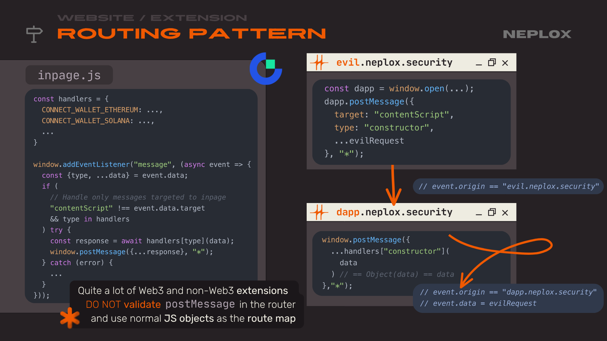

```js title="inpage.js"
const handlers = {
	CONNECT_WALLET_ETHEREUM: ...,
	CONNECT_WALLET_SOLANA: ...,
	...
}

window.addEventListener("message", (async event => {
	const {type, ...data} = event.data;
	if (
		// Handle only messages targeted to inpage
		"contentScript" !== event.data.target
		&& type in handlers
	) try {
		const response = await handlers[type](data);
		window.postMessage({...response}, "*");
	} catch (error) {
		...
	}
}));
```

```js title="evil.neplox.security"
const dapp = window.open(...);
dapp.postMessage({
	target: "contentScript",
	type: "constructor",
	...evilRequest
}, "*");
```

```js title="dapp.neplox.security"
window.postMessage({
	...handlers["constructor"](
		data
	) // == Object(data) == data
}, "*");
```

Why is this bad? Take **Metamask**, for example. They communicate via `postMessage` using their own library. We could send a message – the kind a standard **Metamask** provider would send – from our domain, [neplox.security](https://neplox.security/), to, say, [app.uniswap.org](https://app.uniswap.org/). We could trigger a transaction using that trick with a second extension. The kicker here is that **Metamask** would show the request as coming from **Uniswap**, not our site. Crucially, **Metamask** is not at fault here. The problem is that when you develop an extension, you rarely consider that the user might have a billion other extensions installed that can completely break your `postMessage` logic. When using `postMessage`, there is simply no effective way to defend against these types of attacks.
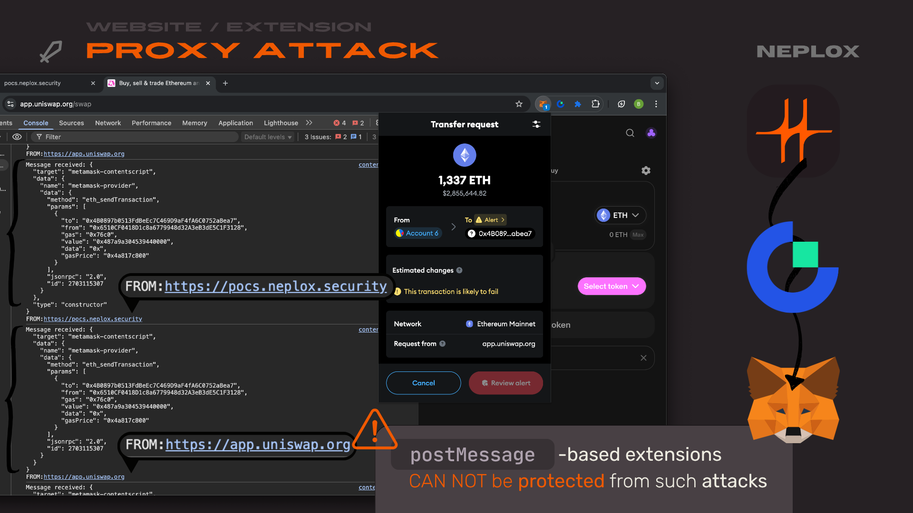

Another good example we found is what's called **Zero Trust Event Handling**. Consider the first example from **Metamask**'s `post-message-stream`: they do not trust any origins or events – everything is validated. However, if we look at **Coinbase**, there is a "backdoor" for their own sites, like [wallet.coinbase.com](https://wallet.coinbase.com). This link allows these domains to essentially act on behalf of any other domain and do whatever they want. This results in a **Spoofing vulnerability**.
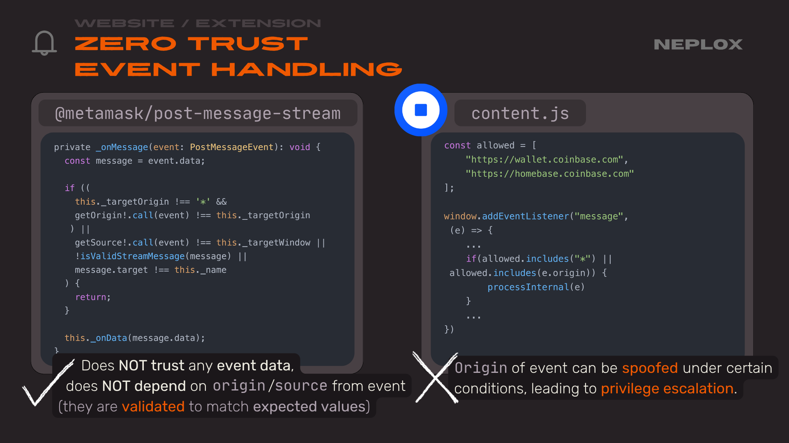

```js title="@metamask/post-message-stream"
private _onMessage(event: PostMessageEvent): void {
	const message = event.data;

	if ((
		this._targetOrigin !== '*' &&
		getOrigin!.call(event) !== this._targetOrigin
	) ||
		getSource!.call(event) !== this._targetWindow ||
		!isValidStreamMessage(message) ||
		message.target !== this._name
	) {
		return;
	}

	this._onData(message.data);
}
```

```js title="coinbase/content.js"
const allowed = [
	"https://wallet.coinbase.com",
	"https://homebase.coinbase.com"
];

window.addEventListener("message",
	(e) => {
		...
		if(allowed.includes("*") ||
		allowed.includes(e.origin)) {
			processInternal(e)
		}
		...
})
```

Again, `postMessage` logic comes from classic web development for apps, not extensions – and this attack vector does not exist there. But in the context of extensions, we are in the same window as the `content` script. This means we can use `window.dispatchEvent` to manually trigger an event rather than sending a `postMessage`. We can send a `newMessageEvent` and set the origin to [wallet.coinbase.com](https://wallet.coinbase.com). We can specify an arbitrary `event.origin` and `event.source`, and it will appear to arrive from that origin, though the `event.isTrusted` field will be `false`. When we reported this to **Coinbase**, they fixed it. If you look at the **Coinbase** extension code now, you will see they paranoidly check that `event.isTrusted` everywhere.
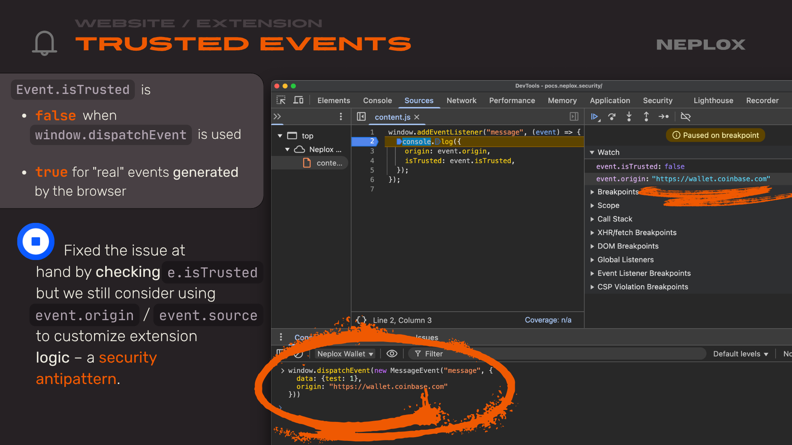

```js title="content.js"
window.addEventListener("message", (event) => {
	console.log({
		origin: event.origin,
		isTrusted: event.isTrusted,
	});
});
```

```js title="Console"
window.dispatchEvent(new MessageEvent("message", {
	data: {test: 1},
	origin: "https://wallet.coinbase.com"
}))
```

A second issue many developers overlook is that we can send something other than a `MessageEvent` entity into a `MessageEvent` handler. In **Chrome**, `EventListener` matching happens by the event name, not the type. For instance, we can create a `MIDIMessageEvent`, which, like a classic `MessageEvent`, has a `data` field but lacks other fields. Occasionally, this can cause issues. Almost no one checks for this, though it rarely creates a major security vulnerability. Even the most popular and secure wallet, **Metamask**, does not check for it.
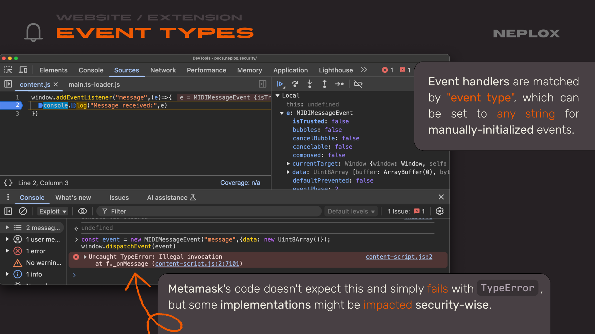

```js title="content.js"
window.addEventListener("message",(e)=>{
	console.log("Message received:",e)
})
```

```js title="Console"
const event = new MIDIMessageEvent("message",{data: new Uint8Array()});
window.dispatchEvent(event)
```

Based on our analysis, we have concluded that **`BroadcastChannel`** – a technology that appeared in browsers relatively recently – is the most suitable for building communication protocols between extension components. This is because it does not rely on the browser's event-based API, which was designed exclusively for standard websites. This API guarantees that a request comes from the same domain. In the `postMessage` proxying attack we showed earlier (sending a `postMessage` to the **Uniswap** window), the attack simply wouldn't work because we couldn't send a message from our site to another domain.

We believe `BroadcastChannel` is the only viable solution to protect against these attacks, which stems from the fact that you, as an extension developer, can not control what other extensions a user has installed.
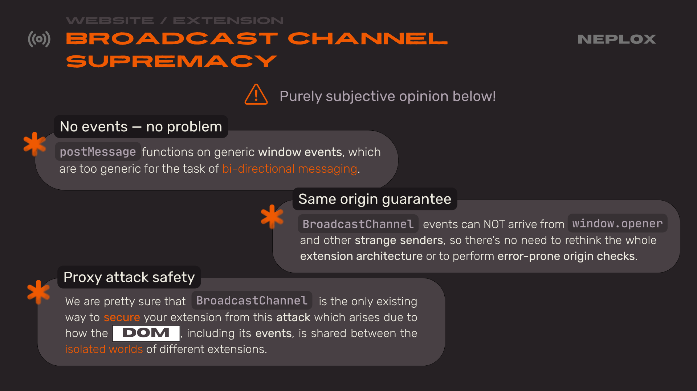

## Chrome vs Extension

Let's move on to the juiciest section: why you should not even trust the browser itself. Why should not you trust your money to a browser or its extensions? Because even a fundamental component like the browser – which implements the entire **Extension API** – can be vulnerable.

Let's take a step back and remember what Service Workers actually are and what they do. For those in Web Development or Security, you know that a **Service Worker** is a background component, a script that a site can register. It runs independently of the execution context across all the site's tabs. However, it can also intercept requests sent by the site. This is frequently used for caching resources; if you implement caching on just one tab, you can not easily share that cache across others. Service Workers act as the glue between tabs to enable these extra features.
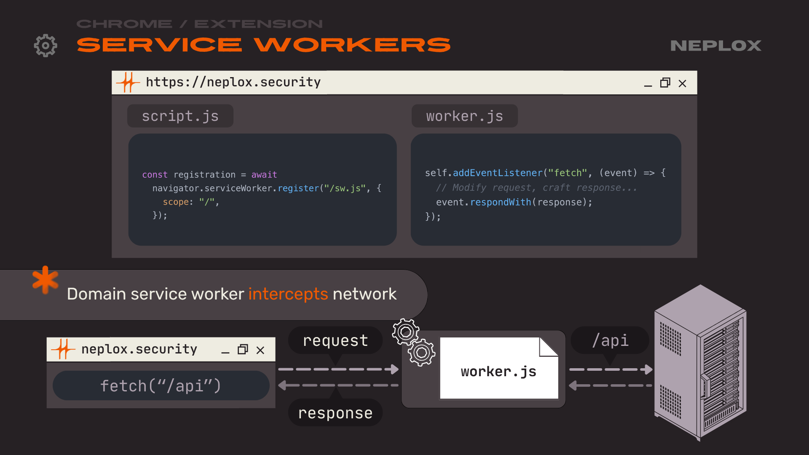

```js title="script.js"
const registration = await
	navigator.serviceWorker.register("/sw.js", {
		scope: "/",
	});
```

```js title="worker.js"
const registration = await
	navigator.serviceWorker.register("/sw.js", {
		scope: "/",
	});
```

When we look at Service Workers in the context of extensions, a new network isolation mechanic comes into play. Just as a `content` script is isolated from the main site by its JavaScript context, its requests must also be isolated. Why? Because otherwise, the site's Service Worker controls the site. If a site's Service Worker could intercept extension requests, it could **spoof** responses and completely break how the extension functions. In the extension security model – as we showed earlier in the architecture section – it is assumed that an extension forms its own "cell" within the domain context that can not be breached by the site itself.
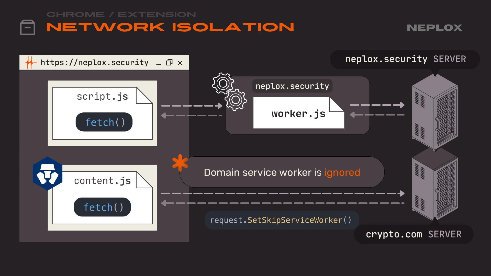

The first issue we found involves a very popular pattern where a `content` script uses an `await import` on a resource belonging to that same extension at runtime. This was everywhere: in crypto wallets like **Crypto.com**, and in mainstream extensions like **1Password**, which has millions of users.
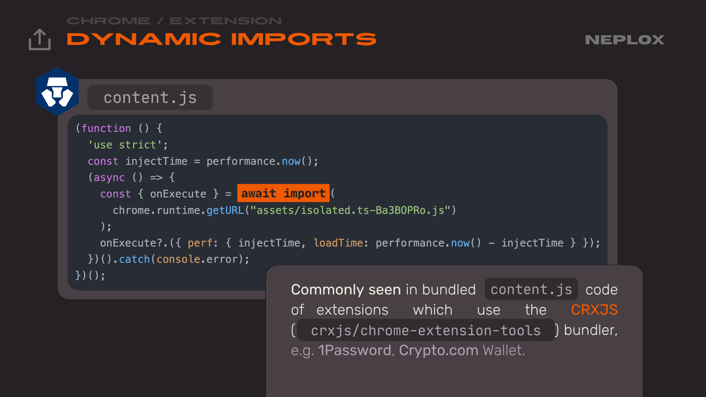

```js title="crypto.com/content.js"
(function () {
	'use strict';
	const injectTime = performance.now();
	(async () => {
		const { onExecute } = await import(
			chrome.runtime.getUrl("assets/isolated.ts-Ba3B0Pro.js")
		);
		onExecute?.({ perf: { injectTime, loadTime: performance.now() - injectTime } });
	})().catch(console.error);
})();
```

What was the problem? It turns out the `import` function inside **Chrome** was unexpectedly non-isolated. The developers simply missed the `request.SetSkipServiceWorker()` line – maybe they did not think it was necessary there.

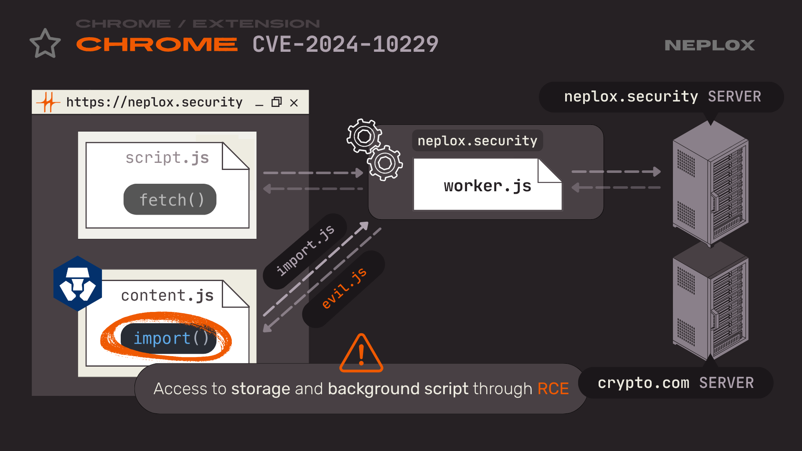

>[!IMPORTANT]
>- [`CVE-2024-10229`](https://chromereleases.googleblog.com/2024/10/stable-channel-update-for-desktop_22.html) (Chromium security severity: **High**):&ensp;Inappropriate implementation in Extensions in Google Chrome prior to `130.0.6723.69` allowed a remote attacker to bypass site isolation via a crafted Chrome Extension.<br/>
>&ensp;

We could register a Service Worker on our own site (e.g. [https://neplox.security](https://neplox.security/)) that checks if a request uses the `chrome-extension` protocol. If it came from the **Crypto.com** extension, we could swap the response with our own JS and gain access to the extension's Storage. This worked until **Chrome** version `129`, where it was patched.
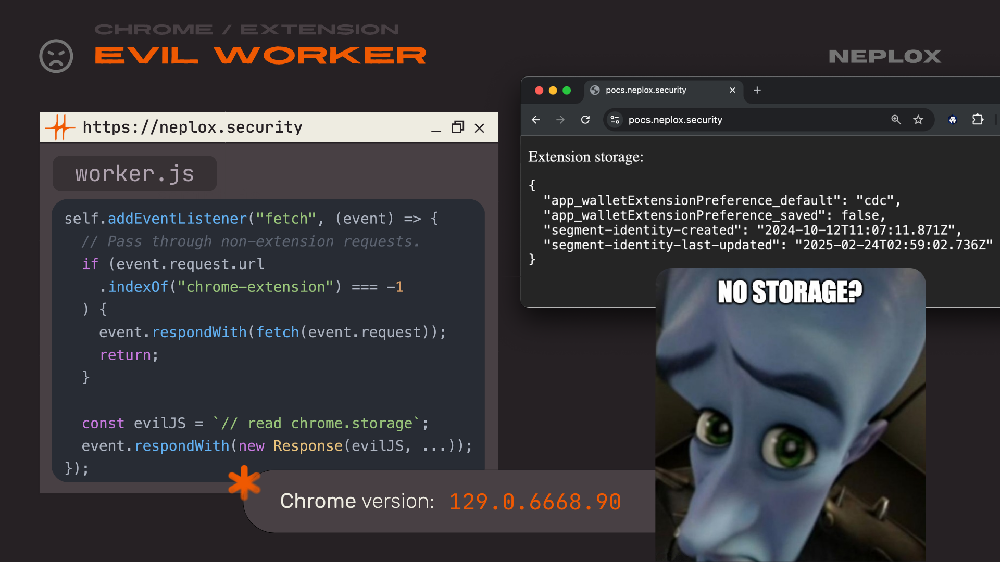

```js title="worker.js"
self.addEventListener("fetch", (event) => {
	// Pass through non-extension requests.
	if (event.request.url
		.indexOf("chrome-extension") === -1
	) {
		event.respondWith(fetch(event.request));
		return;
	}

	const evilJS = `// read chrome.storage`;
	event.respondWith(new Response(evilJS, ...));
});
```

Sometimes there was no Storage, only some useless data. However, if you look at how the `content` script communicates with the `background` script, turns out that since the **Crypto.com** devs assumed the `content` script was safe (since users usually can not mess with it), it handled many sensitive parameters that can serve us as injection points. The simplest example was the `origin`, which effectively allowed **transaction spoofing** – accessing data just like another dApp would. For instance, if a user granted **Uniswap** access to their wallets, we could read that data from our [pocs.neplox.security](https://neplox.security/) by impersonating **Uniswap** and even send transactions.
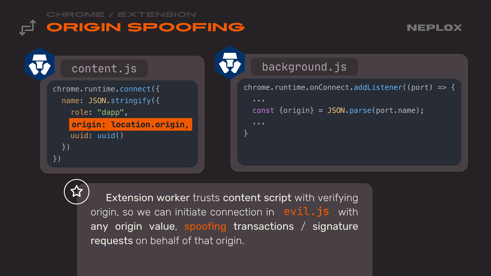

```js title="crypto.com/content.js"
chrome.runtime.connect({
	name: JSON.stringify({
		role: "dapp",
		origin: location.origin,
		uuid: uuid()
	})
})
```

```js title="crypto.com/background.js"
chrome.runtime.onConnect.addListened((port) => {
	...
	const {origin} = JSON.parse(port.name);
	...
})
```

But the problems did not stop there. As we mentioned, the architectural flaw goes deeper. If you think about it, **Chrome** developers having to manually write `request.SetSkipServiceWorker()` for every single network flow is a terrible architectural choice because it is so easy to miss. (Currently, the **Chrome** team does not really focus specifically on extension security; their main priority is usually things like finding RCEs 🙃)

So, we decided to look for other places where `SetSkipServiceWorker()` might have been forgotten. We found another one: the `Link` header. Essentially, `Link` headers inside request responses were also passing through the Service Worker. How does this work? An extension like **Crypto.com** would `fetch` an internal resource that had a `Link` header used to preload a favicon or styles. To grab that resource, it went through our Service Worker. In the response to that preload request, we could send *another* `Link` header with a `modulepreload` directive. If the browser sees this, it follows it – meaning it hits our Service Worker again and caches the JS code. It basically parses it inside V8 and prepares it for module loading. By using this chain of `Link` with `modulepreload`, at the final stage when it requests the extension's `import.js`, we return our malicious JavaScript and get the same level of access as before.

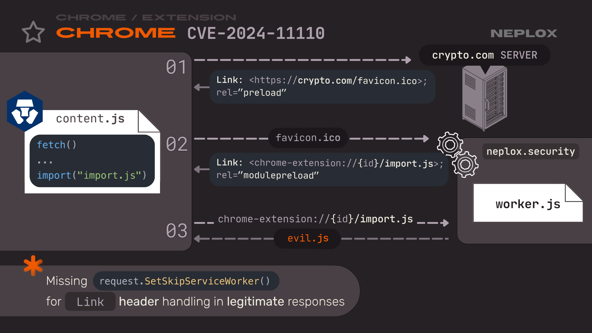

>[!IMPORTANT]
>- [`CVE-2024-11110`](https://chromereleases.googleblog.com/2024/11/stable-channel-update-for-desktop_12.html) (Chromium security severity: **High**):&ensp;Inappropriate implementation in Extensions in Google Chrome prior to `131.0.6778.69` allowed a remote attacker to bypass site isolation via a crafted Chrome Extension.<br/>
>&ensp;

We reported this to **Chrome**, received a CVE, and it is now patched. But this really makes you think about the bigger picture – how poorly the isolation architecture is implemented in **Chrome** and how overlooked it is. Finding that an import is not isolated seems like a simple task. Yet, when we checked, this bug had been sitting in the **Chrome** codebase since Service Workers were first introduced – **10 years** of being non-isolated before we checked. Someone else might read this, look around, find a lot of other places where `SetSkipServiceWorker()` is missing, and find more vulnerabilities.

This is exactly why you can not trust the browser. Using browser extensions – even though it is the most popular way to interact with crypto wallets right now – is a pretty bad idea because you can not fully trust the browser developers themselves. You can write your own code perfectly a thousand times over, but there is just too much undefined behavior and unspecified features in **Chrome** that might allow an attacker to illegitimately target your users.
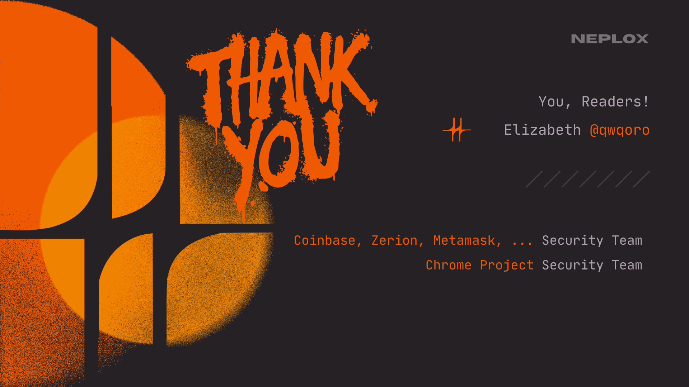

Special thanks to all the vendors – **Coinbase**, **Zerion**, **Metamask** – who communicated with us, and to the **Chrome** team for fixing our vulnerabilities.

