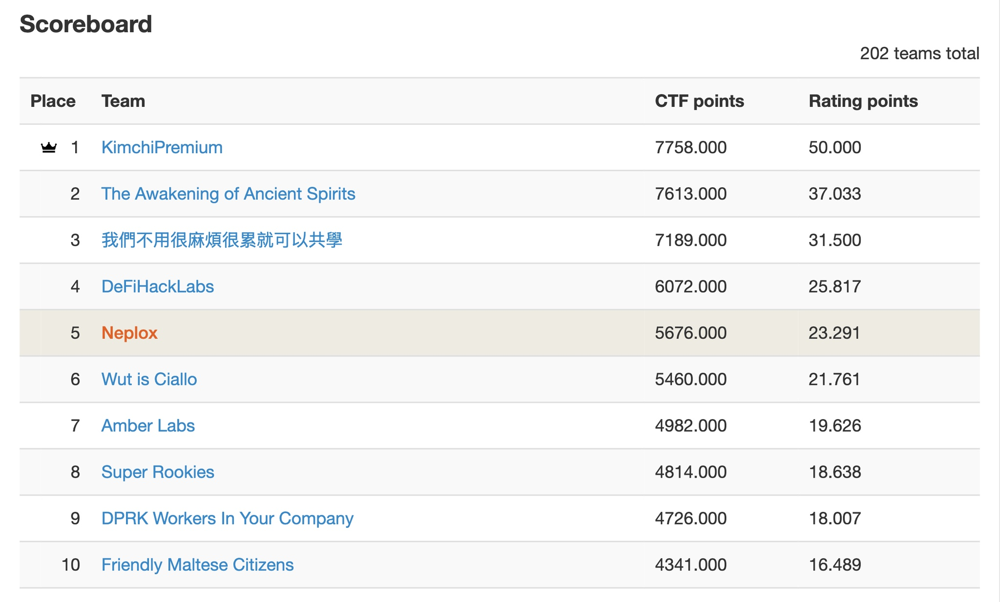
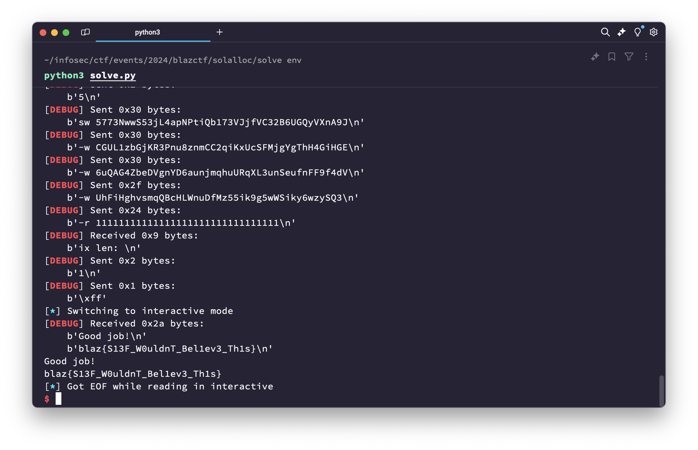

# Draining a Solana Vault through Pointer Corruption

Earlier in September a few of the Neplox team members joined up to participate
in the Web3 BlazCTF ([ctf.blaz.ai](https://ctf.blaz.ai/)), hosted by the awesome Fuzzland team ([fuzz.land](https://fuzz.land/)).
We missed it in 2023, and regretted it once we got around to looking at that year's challenges,
so this year we were ready to take on the interesting challenges and novel ideas BlazCTF had to offer!

We ended up solving nearly all of the 17 challenges, sadly missing a few of the high-scoring ones,
which placed us 5th out of the 200+ teams (see the scoreboard on CTFTime, [ctftime.org/event/2492](https://ctftime.org/event/2492/))
that solved at least one challenge.



As usual, the CTF mostly emphasized Solidity smart contract security, but what we liked was that the authors
also tried to innovate with tasks such as "Chisel as a Service", which required achieving RCE (remote code execution)
through the Chisel Solidity REPL of the Foundry toolkit ([book.getfoundry.sh/chisel/](https://book.getfoundry.sh/chisel/)),
and the King-of-the-Hill style "Teragas", where participating teams were given an old fork of Ethereum,
and the goal was to exploit as many historical hacks as possible to steal the most ETH 🤯

I personally enjoyed solving the Solana challenges the most,
since they are very rarely presented in Web3 CTFs, and are even more
rarely written up, so in this article we'll go through a step-by-step
analysis and solution construction of the "Solalloc" challenge.
If you're interested in checking out our writeups for 7 other tasks
of BlazCTF 2024, visit our GitHub CTF writeup repo @[github.com/neploxaudit/ctfwriteups](https://github.com/neploxaudit/ctfwriteups/tree/main/blazctf-2024).

## Solalloc

As already said, Solalloc was a Solana-based challenge,
developed using OtterSec's `sol-ctf-framework` ([github.com/otter-sec/sol-ctf-framework](https://github.com/otter-sec/sol-ctf-framework)).
The smart contracts, or "programs" as they are called in Solana, were written in C with the use of the Solana Clang toolchain by Anza ([github.com/anza-xyz/platform-tools](https://github.com/anza-xyz/platform-tools)).
Solalloc's program implemented a "rug-pull" style vault, to which anyone could deposit SOL,
but only the initial deployer could withdraw the deposited funds.
As it is hinted in the challenge description and category (PWN), the challenge's solution required exploitation of buggy manual memory management:

> Tony, chasing the Solana hype, hastily ported his Ethereum contracts, playing fast and loose with Solana's memory allocations. As chaos ensued, Tony realized his overconfidence might cost him dearly. Help Tony unravel the mess he's made.

Let's pick apart how the challenge is setup, figure out the goal we need to achieve to solve it,
and then look at it's code to find the vulnerable code which we'll exploit.

## Analysis: Challenge setup

Since solalloc is not a classic Solidity foundry-based Web3 CTF challenge,
lets start by unwinding the task's infrastructure in order to understand how to actually
get the flag. The `Dockerfile` given alongside the source code of the challenge specifies
this command which will be run to start the instance:

```dockerfile
CMD kctf_setup && \
    kctf_persist_env && \
    kctf_drop_privs nsjail --config /nsjail.cfg -- /bin/kctf_restore_env /home/user/server/bin
```

`/home/user/server/bin` itself is initially built using `cargo` from the Rust `server`
source code. `server`'s `main.rs` ([blazctf-2024/solalloc/challenge/server/src/main.rs](https://github.com/fuzzland/blazctf-2024/blob/e802dab6e249d4d1b7359ff6b012de888f05d23c/solalloc/challenge/server/src/main.rs)) contains a simple TCP server which initializes a
`sol_ctf_framework::ChallengeBuilder` for each connection with the following setup steps:

1. The `solalloc.so` program is loaded into the challenge's context.
   It is built in the `Dockerfile` from the `server/program` directory containing
   the program source code in C and a `Makefile` using Solana's `sbf.mk` ([solana.com/docs/programs/lang-c](https://web.archive.org/web/20240915215357/https://solana.com/docs/programs/lang-c)).
2. The player's compiled `.so` program is received via the connection and also loaded into the challenge's context.
3. A random `admin` wallet is generated and funded with 100_000_000_000 lamports (Solana's native token, equivalent to 100 SOL):

   ```rust title="server/src/main.rs"
   let admin_keypair = Keypair::new();
   let admin = admin_keypair.pubkey();

   chall
       .run_ix(system_instruction::transfer(
           &payer,
           &admin,
           100_000_000_000,
       ))
       .await?;
   ```

4. In the same fashion, the player's wallet (called `user`) is generated,
   however it is funded with only 1_000_000_000 lamports (1 SOL).
5. A program-derived address (PDA, [solana.com/docs/core/pda](https://solana.com/docs/core/pda)) is computed for the
   challenge program with the string `BLAZ` as the seed. Such addresses are derived from
   a specific program's "ID" (its public key, pretty much) and arbitrary number of seeds,
   and allow the program to store data and sign "modifications" on behalf of the PDA,
   since Solana can check that the address was derived for a specific program.
   In this case, the PDA is used as a "storage" account by the challenge's program,
   but more about that later. Each derived PDA is returned alongside an additional
   "bump" seed byte, which is needed for PDA derivation to generate correct addresses
   with arbitrary user-provided seeds.
6. An "instruction" (a single part of a Solana transaction) is executed,
   specifying three bytes as the instruction data, and the admin, data, program,
   and system accounts with different permissions. Solana requires instructions
   to specify the read/write capabilities of all accounts to be involved in an
   instruction execution, partially for security, partially for optimization reasons.
   Here, all accounts except the system program account are writable, and the admin
   account is additionally marked as the "signer" of the instruction.:

   ```rust title="server/src/main.rs"
   let ix = Instruction {
       program_id,
       accounts: vec![
           AccountMeta::new(admin, true),
           AccountMeta::new(data_addr, false),
           AccountMeta::new(program_id, false),
           AccountMeta::new_readonly(system_program::id(), false),
       ],
       data: vec![1, data_bump, 0],
   };

   chall.run_ixs_full(&[ix], &[&admin_keypair], &admin).await?;
   ```

7. A player-provided instruction is then read from the connection and executed
   using the player's `user` wallet:
   ```rust title="server/src/main.rs"
   let solve_ix = chall.read_instruction(solve_id)?;
   chall
       .run_ixs_full(&[solve_ix], &[&user_keypair], &user_keypair.pubkey())
       .await?;
   ```
8. _Finally_, the challenge checks that the `user` wallet has over 2 SOL balance (remember that we are initially given only 1 SOL), and, if so, the flag is sent from an environment variable:

   ```rust title="server/src/main.rs"
   if let Some(account) = chall.ctx.banks_client.get_account(user).await? {
       if account.lamports > 2_000_000_000 {
           writeln!(
               socket,
               "Good job!\n{}",
               std::env::var("FLAG").unwrap_or_else(|_| "flag{test_flag}".to_string())
           )?;
   ...
   ```

## Analysis: Challenge program

Now that we know the challenge solution requirements, lets figure out how we
can interact with the program in order to get an additional SOL from sent to us.
As described in Solana's C development documentation ([solana.com/docs/programs/lang-c](https://web.archive.org/web/20240915215357/https://solana.com/docs/programs/lang-c)),
the program's implementation begins with the `entrypoint` function ([blazctf-2024/solalloc/challenge/server/program/src/solalloc/solalloc.c#L38](https://github.com/fuzzland/blazctf-2024/blob/e802dab6e249d4d1b7359ff6b012de888f05d23c/solalloc/challenge/server/program/src/solalloc/solalloc.c#L38)).
It starts by reading the instruction parameters into `SolParameters` and `SolAccountInfo`
structures and performing basic validation of the specified accounts to make sure that
the first account (labeled `CALLER`) is the signer and the third account (labeled `PROGRAM_ID`)
actually matches the current program's ID:

```c title="solalloc.c"
if (!sol_deserialize(input, &params, SOL_ARRAY_SIZE(accounts))) {
  return ERROR_INVALID_ARGUMENT;
}

memcpy(&caller_key, accounts[CALLER].key, SIZE_PUBKEY);
memcpy(&data_account_key, accounts[DATA_ACCOUNT].key, SIZE_PUBKEY);
memcpy(&program_id, accounts[PROGRAM_ID].key, SIZE_PUBKEY);
memcpy(&system_id, accounts[SYSTEM_ID].key, SIZE_PUBKEY);

if (!accounts[CALLER].is_signer) {
  return ERROR_BLAZ + 0;
}

if (memcmp(&program_id, params.program_id, SIZE_PUBKEY) != 0) {
  return ERROR_BLAZ + 1;
}
```

The instruction data is then consumed as a list of "UserInput" structs,
with the first byte specifying the number of total inputs:

```c title="solalloc.c"
typedef struct __attribute__((packed)) {
    uint8_t bump;
    uint8_t type;
    uint64_t amount;
    uint64_t msg_size;
    uint8_t msg[0];
} UserInput;

...

len_actions = params.data[0];
if (len_actions == 0 || len_actions > 3) {
    return ERROR_BLAZ;
}

uint64_t offset = 1;

while (len_actions--) {
    UserInput *current_input = (UserInput *)(params.data + offset);
```

Each input's `bump` is used to derive a PDA and verify that it matches the
`DATA_ACCOUNT` account specified in the instruction:

```c title="solalloc.c"
offset += sizeof(uint8_t);
user_bump = current_input->bump;
if (sol_create_program_address(seeds, SOL_ARRAY_SIZE(seeds), &program_id,
                                &data_account_key_verify) != SUCCESS) {
  return ERROR_BLAZ + 3;
}

if (memcmp(&data_account_key, &data_account_key_verify, SIZE_PUBKEY) != 0) {
  return ERROR_BLAZ + 4;
}
```

The input is then processed based on its `type` byte, with `INIT`, `DEPOSIT`, and `WITHDRAW` being the possible types. If we recall the instruction executed during
`main.rs`, it was: `vec![1, data_bump, 0]`, where the `0` corresponds to the `INIT` type.
`INIT` ([blazctf-2024/solalloc/challenge/server/program/src/solalloc/solalloc.c#L101](https://github.com/fuzzland/blazctf-2024/blob/e802dab6e249d4d1b7359ff6b012de888f05d23c/solalloc/challenge/server/program/src/solalloc/solalloc.c#L101)) basically calls the system program to actually _create_ the PDA account,
as long as it does not exist yet (`data_len == 0`), and set its `data` field
to the `CALLER` account's address. Since we know the solution requirements,
lets immediatelly try to see how we could exploit the `WITHDRAW` method to extort funds
using it simply based on its name:

```c title="solalloc.c"
case WITHDRAW: {
    offset += sizeof(uint64_t);
    uint64_t amount = current_input->amount;
    offset += sizeof(uint64_t);
    char *message =
        (char *)malloc(allocator, current_input->msg_size);

    if (message != NULL) {
        strcpy(message, (char *)&current_input->msg);
        offset += strlen(message) + 1;
    }

    // only owner can withdraw
    if (memcmp(accounts[DATA_ACCOUNT].data, &caller_key,
                SIZE_PUBKEY) != 0) {
        return ERROR_BLAZ;
    }

    *accounts[DATA_ACCOUNT].lamports -= amount;
    *accounts[CALLER].lamports += amount;
    break;
}
```

As we can see, the `WITHDRAW` method specifically verifies that the `CALLER` account
from the current instruction matches the `CALLER` account which was used to initialize
the PDA account with `INIT`. Since the player's instruction is executed with the `user`
wallet, this check will always fail. What's strange however, is that it uses a stack-local
`caller_key` variable to perform the comparison, instead of the actual `accounts[CALLER].key` value. Both the `WITHDRAW` and `DEPOSIT` methods also read an arbitrary `message`
null-terminated byte-string from the instruction data, which isn't even used for anything
afterwards. Knowing that the task is related to memory management bugs, lets try to
see how these "messages" are allocated and used.

Solana's C development documentation mentions memory allocation in the "Heap" section ([solana.com/docs/programs/lang-c#heap](https://web.archive.org/web/20240915215357/https://solana.com/docs/programs/lang-c#heap)),
specifying that programs can use the `calloc` syscall or implement their own allocators
using the 32KB region starting at the `0x300000000` address. `solalloc` implements
its own `malloc` function using a so-called `BlazAllocator` structure, which consists
of a single `uint64_t free_ptr` field. `BlazAllocator` is initialized using the `init_allocator` function like so:

```c title="solalloc.c"
BlazAllocator *init_allocator() {
  BlazAllocator *allocator = (BlazAllocator *)HEAP_START_ADDRESS_;
  allocator->free_ptr = HEAP_START_ADDRESS_ + sizeof(BlazAllocator);
  return allocator;
}
```

Where `HEAP_START_ADDRESS_` is equal to the `0x300000000` address constant we saw mentioned
in the documentation. `malloc` calls then simply increase the `free_ptr` field by the
amount specified, checking that the pointer does not overflow the 32KB heap region end:

```c title="solalloc.c"
void *malloc(BlazAllocator *self, uint64_t size) {
  if (size == 0) {
    return NULL;
  }

  uint64_t size_aligned = (size + 7) & ~7;

  if (self->free_ptr + size_aligned > HEAP_END_ADDRESS_) {
    return NULL;
  }

  uint64_t *ptr = (uint64_t *)self->free_ptr;
  self->free_ptr += size_aligned;

  return ptr;
}
```

Aha! As we can see, the `HEAP_END_ADDRESS_` check does not check for `uint64_t` overflow,
which can easily occur considering that we are able to pass an arbitrary `uint64_t size`
using the `msg_size` field of the `UserInput` structure. This would allow us to overflow
the `free_ptr` field to one of the other memory regions available in Solana ([solana.com/docs/programs/faq#memory-map](https://solana.com/docs/programs/faq#memory-map)). If we recall, `WITHDRAW` checks that the
`caller_key` stack variable matches the original program initializer.
Despite it being set to the `accounts[CALLER].key` value, due to the `free_ptr` overflow,
we can get `malloc` to return a pointer to the `caller_key` stack variable,
and overwrite its value using the `message` field of our input.
This allows us to bypass the ownership check in `WITHDRAW` and drain funds from the
admin.

## Solution

Let's start by summarizing the solution plan. First, we need to overflow the `free_ptr`
pointer to the address at which the `caller_key` variable is stored on the stack.
This address can be found by logging it using the `sol_log_64` method if we launch the task locally.
However, since `WITHDRAW` would stop the instruction with an error, we need to use
the `DEPOSIT` method for this step, which also accepts arbitrary `message` strings.
Then, we need to call `WITHDRAW` with the admin account public key as the message,
which would be used to override the `caller_key` address returned by `malloc`.
An additional requirement is that all of this is done in a single instruction,
since the `BlazAllocator` is initialized at the start of each execution.
This is not a problem, since `solalloc` allows us to specify up to 3 inputs per instruction.

Since the task creators have provided a sample solve script,
all we need to do is modify it to specify correct account addresses and data
for our `solve.c` Solana program, which is sent to the server in its compiled form once we connect to it.

`solve.c` itself contains a pretty simple implementation of the above plan,
sending an instruction to the task program with these 2 inputs:

```c title="solve.c"
UserInput ixInputDeposit = {
    .bump = bump,
    .type = 1,
    .amount = 1000,
    // 0x300000000 is HEAP_START_ADDRESS_, 8 bytes are used by `free_ptr`
    .msg_size = ((uint64_t)(0x200000fde) - (uint64_t)(0x300000000 + 8)),
    .msg = "\x00",
};

UserInput ixInputWithdraw = {
    .bump = bump,
    .type = 2,
    .amount = 2_000_000_000, // 2 SOL
    .msg_size = 8,
    .msg = "\x00", // replaced with admin's pubkey in the final instruction data
};
```

`solve.py` simply sends all the `USER`, `ADMIN`, `DATA_ACCOUNT`, `PROGRAM_ID`, and `SYSTEM_ID` addresses to our program,
alongside the `DATA_ACCOUNT`'s bump seed, which is calculated using the `solders`' library `Pubkey.find_program_address` method.

The full solution files are available in our `ctfwriteups` GitHub repository, [blazctf-2024/solalloc/solve.c](https://github.com/neploxaudit/ctfwriteups/blob/main/blazctf-2024/solalloc/solve.c) and [blazctf-2024/solalloc/solve.py](https://github.com/neploxaudit/ctfwriteups/blob/main/blazctf-2024/solalloc/solve.py).



## In conclusion

Thanks to the BlazCTF 2024 organizers for hosting a great Web3 CTF,
of which there are only a few overall, but even less of them are this diversified in terms of
the categories and technologies used to build vulnerable challenges.
Neplox will be looking forward to the next one,
and we'll be sure to prepare to participate with a larger team now that we know the quality of the event!

Being founders of a very successful CTF team ourselves, C4T BuT S4D (check us out on [CTFTime](https://ctftime.org/team/83435/)),
we're always fond of seeing CTF organization and development taken seriously and with passion.

Interested in working with us, joining up forces for a CTF or Bug Bounty?
Looking for a security audit from experts who'll dig deep into your project instead of just picking the low-hanging fruit?
Drop your contact info at [neplox.security/#contact-us](https://neplox.security/#contact-us) and we'll get back to you ASAP.
